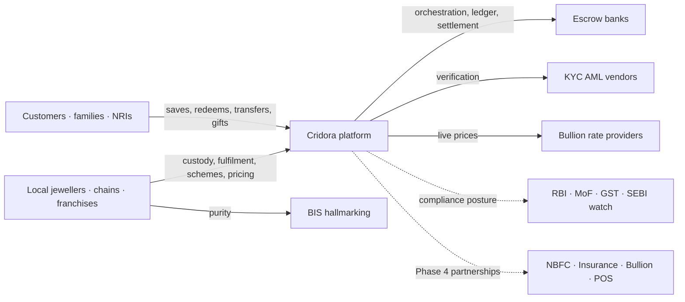
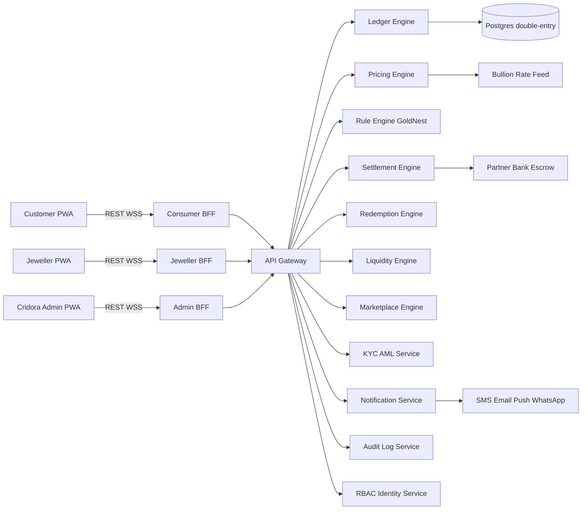
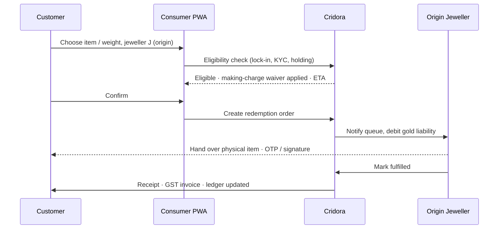
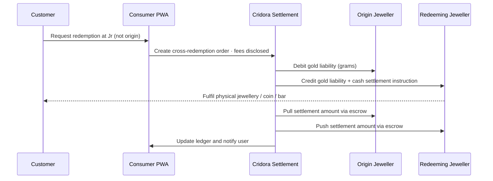
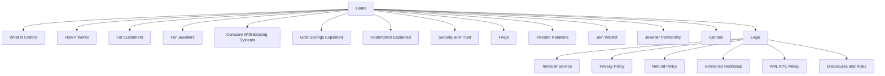
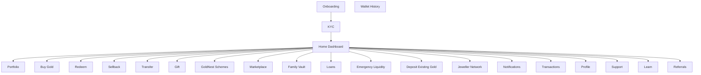

# Cridora — Product Architecture & UX Planning Document

> Master implementation blueprint that converts the Cridora India DPR v4.0 into an implementation-ready architecture. This is the single source of truth for product, design, and engineering during build-out of Cridora's distributed precious-metals savings, redemption, and settlement infrastructure.

## Table of Contents

1. [Core Platform Understanding](#1-core-platform-understanding)
2. [User Types & RBAC](#2-user-types--rbac)
3. [Public Website Architecture](#3-public-website-architecture)
4. [Customer App Architecture](#4-customer-app-architecture)
5. [Jeweller Dashboard Architecture](#5-jeweller-dashboard-architecture)
6. [Cridora Admin System](#6-cridora-admin-system)
7. [Feature Communication Strategy](#7-feature-communication-strategy)
8. [Design System](#8-design-system)
9. [Navigation & UX Flow](#9-navigation--ux-flow)
10. [Future Scalability](#10-future-scalability)
11. [Technical Planning](#11-technical-planning)
12. [Implementation Roadmap](#12-implementation-roadmap)
13. [Output Format & Appendices](#13-output-format--appendices)

---

## 1. Core Platform Understanding

### 1.1 Brand Posture (One-Line North Star)

> **Cridora is India's trusted digital gold savings & redemption network — connecting customers, jewellers, savings schemes, and settlement into one unified ecosystem.**

The platform must, at every surface, feel **trustworthy, premium, simple, gold-oriented, India-first, financially safe, beginner-friendly, merchant-friendly, enterprise-scalable**. It must explicitly avoid feeling **crypto-like, speculative, trading-terminal-heavy, neon-fintech, or scam-like**. Every IA, copy, and visual decision in this document is filtered through that posture.

### 1.2 Core Business Model

Cridora is a **B2B2C infrastructure company**, not a financial product. It operates four interlocking layers:

1. **Distributed custody network** — physical BIS 916 gold remains with participating jewellers, who act as custodians and redemption operators. Cridora itself never takes custody of metal or pools customer funds.
2. **Programmable jeweller operating system (SaaS)** — every jeweller gets a configurable dashboard for pricing, lock-ins, making charges, GoldNest schemes, marketplace storefront, inventory, settlements, staff, and compliance.
3. **Interoperability and settlement infrastructure** — a ledger and settlement engine that lets a customer buy gold from one jeweller and redeem it from any other jeweller in the network, with liability and cash flows reconciled automatically through escrow.
4. **Consumer super-app for gold** — a single app where Indians can save in grams, redeem at any participating jeweller, gift, transfer, run family vaults, access emergency liquidity, and join custom GoldNest schemes.

### 1.3 Revenue Model

| Stream | Type | Driver | Notes |
| --- | --- | --- | --- |
| Transaction fees | Recurring (per txn) | Buy / sellback / transfer volume | Smallest %, largest volume |
| Settlement fees | Infrastructure | Cross-jeweller redemption | Network-effect lever |
| Redemption fees | Transactional | Cross-network redemptions | Visible to user pre-confirm |
| Emergency liquidity fees | Financial service | Cridora-routed liquidity events | Fee, not interest — see §1.10 |
| SaaS subscription | Monthly | Jeweller dashboard tiers | Free / Growth / Chain |
| Marketplace promotion | Advertising | Featured listings, festival campaigns | Auctioned slots |
| Enterprise integrations | B2B contracts | Bullion / NBFC / insurance / POS / NFC | Phase 4 |
| Scheme engine licensing | Infrastructure | GoldNest white-label | Phase 3+ |
| Referral campaign partnerships | Promotional | Brand co-marketing | Optional |

**Important framing:** Cridora's revenue is fee-based and infrastructure-aligned. It does **not** earn from spread on customer holdings, interest on loans, or margin on bullion. This is essential for the legal posture in §1.16.

### 1.4 Stakeholder Ecosystem



### 1.5 High-Level Technical Topology



### 1.6 Settlement Architecture (Money + Metal)

Cridora operates **two parallel ledgers** that must always reconcile:

- **Metal ledger** — denominated in grams (BIS 916, 4-decimal precision). Records customer holdings and jeweller liabilities.
- **Cash ledger** — denominated in INR paise. Records customer wallet (transient only — funds pass through escrow), jeweller receivables/payables, and Cridora fee revenue.

**Settlement rule:** Every operation produces a double-entry on both ledgers. Cash never sits on Cridora's balance sheet; it moves directly between escrow sub-accounts owned by jewellers, with Cridora taking only its disclosed fee from the transaction at settlement time.

### 1.7 Gold Liability Architecture

When a customer buys ₹X of gold via Jeweller A:

1. Cash flows: Customer → Escrow → Jeweller A (less Cridora fee).
2. Metal ledger: Cridora records `+ Xg` against customer's holdings AND `+ Xg` liability against Jeweller A (Jeweller A "owes" Xg of gold to the network, redeemable by any holder).
3. Jeweller A is contractually bound to honour redemption either directly OR via cross-jeweller settlement.

The system at any moment can answer: "What is the total gold liability of Jeweller A?" — a critical solvency metric surfaced in both the jeweller's own dashboard and Cridora Admin.

### 1.8 The 13 Lifecycles

#### 1.8.1 User Lifecycle

`Awareness → Waitlist → Signup → KYC pending → KYC verified → First buy → Active saver → Power user (referrals, family vault, GoldNest, redemption) → Lifetime customer / Dormant / Offboarded`

States surfaced in the customer's profile and Cridora Admin user view.

#### 1.8.2 Jeweller Lifecycle

`Lead → Application submitted → KYC & store verification → BIS purity verification → Onboarding training → Sandbox (test transactions) → Live (Free tier) → Growth tier (paid SaaS) → Chain tier → Trust-scored partner → Strategic partner / Suspended / Offboarded`

Trust score drives marketplace visibility, cross-jeweller routing priority, and emergency liquidity participation.

#### 1.8.3 Redemption Lifecycle (Same-Jeweller)



#### 1.8.4 Redemption Lifecycle (Cross-Jeweller)



Cross-redemption SLA: standard fulfilment under 48 hours; immediate where Jr has inventory. User pays disclosed cross-network fee + Jr-specific making charges. Cridora retains a thin settlement fee.

#### 1.8.5 Transfer Lifecycle (Inter-Personal Gold Transfer)

`Sender selects recipient (phone/UPI ID/Cridora handle) → Recipient lookup → Disclosure of fees + tax note → OTP confirm → Metal ledger entry (sender − g, recipient + g, jeweller liability unchanged) → Notification to recipient → Wedding/gift annotation optional`

Edge case: recipient does not yet have an account → invitation flow with 14-day claim window.

#### 1.8.6 Loan Lifecycle (Jeweller-Backed)

`Eligibility check → LTV calc (jeweller-configured) → Disclose: principal, processing fee, repayment terms → Lock collateral grams in metal ledger → Disburse cash via jeweller / Cridora payout rails → Repayment schedule → Unlock collateral on full repayment, OR foreclosure auction by jeweller as last resort`

**No interest** — flat processing fee only. Cridora orchestrates; the loan is contractually between customer and jeweller.

#### 1.8.7 Emergency Fund Lifecycle (Cridora-Routed Liquidity)

`User initiates emergency liquidity → Cridora applies haircut + risk deduction + emergency fee → User assigns holdings to Cridora pool → Payout to user (typically 50–70% of holding value) → Window to repurchase holdings at market + small spread, OR Cridora liquidates via partner jeweller after window expires`

Distinct from §1.8.6: emergency liquidity is **platform-level** and used when the user does not want jeweller-specific terms.

#### 1.8.8 Gold Deposit Lifecycle (Bring Your Own Gold)

`Book appointment at participating jeweller → Physical purity test (XRF / touchstone / BIS) → Weight + purity recorded → Customer signs digital intake → Jeweller credits grams into customer ledger → Jeweller now holds liability for that gold → Customer can redeem, transfer, sell, or collateralise`

Anti-fraud: photo + video evidence stored, dual-operator sign-off above threshold, deposit cap before secondary review.

#### 1.8.9 GoldNest Scheme Lifecycle

`Jeweller designs scheme (Builder) → Compliance auto-checks → Publish → Customer discovers → Customer enrols → Monthly contributions (auto-debit / manual) → Maturity rules trigger → Customer redeems jewellery / coins / waiver applied → Scheme closed`

#### 1.8.10 Marketplace Lifecycle

`Jeweller uploads products / collections / campaigns → Cridora moderation → Live in marketplace → Customer browses → Customer buys via gold holdings + cash top-up → Order routed to jeweller → Fulfil → Review`

#### 1.8.11 Referral Lifecycle

`User shares referral link → Referee signs up → Referee completes KYC + first buy ≥ ₹X → Reward credited to referrer (config: ₹50 wallet OR ₹50 metal) → Anti-abuse checks (device, IP, KYC) → Reward unlocks after cooling period`

#### 1.8.12 Cross-Jeweller Settlement Lifecycle (Daily Net Settlement)

`All cross-redemption + transfer events queued through day → Settlement Engine nets bilateral positions between jewellers → 23:00 IST cutoff → Generate settlement instructions → 09:00 IST escrow movement next business day → Reconciliation report → Audit log signed`

#### 1.8.13 Family Vault Lifecycle

`Admin creates vault → Invites members (mobile / email) → Members accept → Contribution rules (open / admin-controlled / scheduled) → Members deposit grams → Vault holdings visible to all members per role → Redemption / transfer requires Admin approval (or multi-member quorum if configured) → Member exit returns pro-rata share`

### 1.9 Cridora vs Jeweller Responsibilities

| Responsibility | Cridora | Jeweller |
| --- | --- | --- |
| Physical custody of gold | No | Yes |
| GST invoicing on buy / redemption | No | Yes |
| Sale of metal to customer | No (technology only) | Yes |
| Live-rate publishing | Reference price + spread tooling | Final markup |
| KYC collection | Orchestrates vendor | Co-validates at deposit |
| Settlement orchestration | Yes | Participates |
| Ledger of truth | Yes | Read-only mirror |
| Loan contract | No | Yes (parties: customer + jeweller) |
| Emergency liquidity contract | Yes (Cridora is counterparty) | No |
| Marketplace storefront | Hosts | Owns content |
| Scheme rules | Engine + compliance check | Configures + signs T&Cs |
| Fulfilment SLA | Monitors | Owns |
| Disputes (gold quality, weight) | Adjudicates per network policy | Primary respondent |
| Audit & reconciliation | Daily | Cooperates |

### 1.10 Legal Separation Model

To preserve the "infrastructure, not financial institution" posture, Cridora **must avoid**:

- Pooled customer funds (escrow sub-accounts are per-jeweller, not pooled into Cridora)
- Guaranteed returns language anywhere in product, marketing, or schemes
- Speculative investment marketing ("trade gold", "earn returns", "profit from gold")
- Centralised metal custody (Cridora never holds metal directly)
- Investment advisory positioning
- Use of words like "deposit", "savings account", "interest", "yield" in customer-facing surfaces (use "holdings", "scheme", "fee", "accumulation")

Cridora positions as:

- Technology infrastructure provider
- Settlement and interoperability network
- Programmable jeweller operating system
- Digital ledger ecosystem
- Merchant enablement platform

Jewellers remain the **sellers, GST entities, custodians, redemption operators**.

### 1.11 Multi-Metal Future Architecture

Architecture is `Metal → Purity → Ledger → Settlement` from day one. Launch SKU: `Gold · BIS-916`. The data model accepts new metals + purities via configuration only — no code rewrites. See §10 for the full extensibility plan and §11.6 for the data model.

### 1.12 Customer Psychology Map

| Concern | Surface | Mitigation |
| --- | --- | --- |
| "Is my gold real?" | Onboarding · jeweller page | BIS hallmark badge, custodian disclosure, jeweller licence shown |
| "What if a jeweller goes bust?" | Help · trust page | Network insurance disclosure, daily liability reporting, network-wide redemption right |
| "Will I be locked in?" | Buy · scheme page | Plain-English lock-in counter, "redeem anywhere" badge |
| "Hidden fees" | Every confirm screen | Itemised breakdown with "Why this fee?" inline info |
| "GST surprise" | Buy · redeem | GST shown at buy time; redemption "no further GST on metal" reassurance |
| "Tax on sellback" | Sellback | Plain-English capital-gains warning + link to tax help |
| "What is a making charge?" | Redemption | Illustrated explainer with example |
| "I don't trust apps with my money" | All surfaces | Indian-family imagery, BIS / RBI compliance badges, founders + auditors named |

### 1.13 Trust-Building Requirements (Cross-Cutting)

- **Named humans:** Founders, auditors, custodian jewellers — never anonymous.
- **Real jewellers:** Every participating shop has a public profile with address, GSTIN, BIS licence, photos, owner name.
- **Transparency by default:** Every fee, lock-in, making charge, spread, deduction is visible *before* confirm.
- **Receipts always:** GST invoice, ledger entry hash, immutable transaction ID.
- **Reverse-able actions:** 60-second cancel window on buy and gift; no surprises.
- **Education-first:** Every complex term has a contextual info card with plain Hindi/English copy and illustration slot.
- **Compliance badges:** BIS · GSTIN · MSME · ISO-27001 (planned) prominently displayed.

### 1.14 Future Scalability (Summary; full in §10)

Modular extensibility for: silver, platinum, additional gold purities, regional bullion, bullion partners, enterprise APIs, NFC/RFID inventory, POS integrations, insurance partners, NBFC partners, franchise jewellers, multi-country.

---

## 2. User Types & RBAC

Cridora has a **deeply hierarchical role taxonomy**. The role system uses **role-based + attribute-based** access (RBAC + ABAC). Every action is permission-gated; every API call is audited.

### 2.1 Role Taxonomy (Final, Production)

#### A. Public Roles

- `guest` — anyone on the public website, no auth
- `waitlist` — email/phone captured for waitlist; no app access
- `investor_lead` — submitted investor relations form
- `jeweller_lead` — submitted jeweller partnership form

#### B. Customer Roles

- `customer` — KYC-verified individual customer (primary consumer role)
- `family_admin` — customer who created and owns a Family Vault
- `family_member` — customer invited into a Family Vault
- `gifting_user` — customer flagged as a known gift recipient (anti-abuse signal)
- `referral_user` — customer with active referral campaign participation

#### C. Jeweller Roles

- `jeweller_owner` — sole authority over a jeweller account, billing, T&Cs
- `branch_manager` — manages a single branch (multi-branch jewellers)
- `cashier` — processes buy / redeem / sellback at counter
- `redemption_operator` — fulfils redemption orders, OTP verification
- `inventory_manager` — adds, edits, audits physical inventory
- `finance_staff` — sees settlements, accounting, GST, payouts
- `support_staff` — handles customer queries via the jeweller dashboard

#### D. Cridora Internal Roles

- `cridora_super_admin` — break-glass; full surface, paired-action enforced
- `settlement_admin` — settlement engine controls, escrow visibility
- `kyc_admin` — KYC review queue, manual approvals
- `fraud_admin` — fraud alerts, lock accounts, run pattern queries
- `support_admin` — customer + jeweller support, refunds (within limit)
- `marketplace_admin` — moderation, featured slots, takedowns
- `campaign_admin` — referral programmes, promotional credits
- `finance_admin` — Cridora P&L, fee engine, reconciliation
- `analytics_admin` — read-only analytics + exports

#### E. Future Enterprise Roles (Phase 4)

- `bullion_partner` — bullion provider portal access
- `auditor` — read-only audit access with audit-trail logging of every read
- `insurance_partner` — claims, policy uploads, payout flows
- `nbfc_partner` — loan partner portal (post-NBFC integration)

### 2.2 Permission Model

The system uses a **`subject : action : resource : conditions`** policy model:

`subject = role(s) + user_id + organization_id + branch_id`
`action ∈ { view, create, update, delete, approve, execute, export }`
`resource = module name (e.g. holdings, redemption_orders, schemes, settlements)`
`conditions = ABAC predicates (e.g. branch_id matches, KYC status verified, amount under cap)`

Every API has a policy block in OpenAPI; every UI render checks the same policy via a shared client SDK.

### 2.3 Role Matrix (Permissions × Modules)

> Notation: **F** full · **R** read-only · **W** create/update · **A** approve · **E** execute · **—** no access · **C** conditional (ABAC)

#### Customer-facing modules

| Module | customer | family_admin | family_member | jeweller_owner | branch_manager | cashier | cridora_super_admin |
| --- | --- | --- | --- | --- | --- | --- | --- |
| Own profile | F | F | F | — | — | — | R |
| Holdings (own) | F | F | C | — | — | — | R |
| Holdings (family vault) | — | F | C | — | — | — | R |
| Buy gold | E | E | E | — | — | — | — |
| Redeem (same-jeweller) | E | E | C | — | — | — | — |
| Redeem (cross-jeweller) | E | E | C | — | — | — | — |
| Sellback | E | E | C | — | — | — | — |
| Transfer (P2P) | E | E | C | — | — | — | — |
| Gift gold | E | E | C | — | — | — | — |
| Referral | E | E | E | — | — | — | A |
| Loans | E | E | C | A | — | — | A |
| Emergency liquidity | E | E | C | — | — | — | A |
| GoldNest enrolment | E | E | C | — | — | — | A |
| Marketplace browse | F | F | F | — | — | — | F |

#### Jeweller modules

| Module | jeweller_owner | branch_manager | cashier | redemption_operator | inventory_manager | finance_staff | support_staff |
| --- | --- | --- | --- | --- | --- | --- | --- |
| Dashboard overview | F | C (branch) | R | R | R | F | R |
| Customer directory | F | C | R | R | — | R | F |
| Gold liabilities | F | C | — | — | — | F | — |
| Inventory | F | C | — | — | F | R | — |
| Redemption queue | F | C | W | F | — | R | R |
| Sellback queue | F | C | W | F | — | R | R |
| Transfer queue | F | C | R | F | — | R | R |
| Loan management | F | A | — | — | — | F | — |
| Emergency fund (info only) | F | R | — | — | — | F | — |
| Deposit verification | F | A | — | E | E | — | — |
| GoldNest builder | F | C | — | — | — | — | — |
| Marketplace | F | C | — | — | F | — | — |
| Campaigns | F | C | — | — | — | — | — |
| Live rate engine | F | C | — | — | — | R | — |
| Pricing markup controls | F | C | — | — | — | R | — |
| Lock-in / making charge rules | F | C | — | — | — | R | — |
| Analytics | F | C | — | — | — | R | — |
| Settlement center | F | R | — | — | — | F | — |
| Accounting / GST | F | R | — | — | — | F | — |
| KYC / compliance | F | A | — | — | — | R | R |
| Fraud alerts | F | A | — | — | — | — | R |
| Branch management | F | C | — | — | — | — | — |
| Staff & RBAC | F | C | — | — | — | — | — |

#### Cridora Admin modules

| Module | super | settlement | kyc | fraud | support | marketplace | campaign | finance | analytics |
| --- | --- | --- | --- | --- | --- | --- | --- | --- | --- |
| Network overview | F | R | R | R | R | R | R | R | F |
| Live settlement map | F | F | — | R | — | — | — | R | F |
| Jeweller trust scoring | F | F | F | F | R | F | — | R | F |
| KYC review | F | — | F | R | R | — | — | — | R |
| Fraud monitoring | F | R | R | F | R | — | — | R | R |
| Disputes | F | R | R | F | F | R | — | R | R |
| Emergency fund | F | F | — | A | R | — | — | F | R |
| Marketplace moderation | F | — | — | R | R | F | F | — | R |
| Transaction monitoring | F | F | R | F | R | — | — | F | F |
| Liability balancing | F | F | — | R | — | — | — | F | R |
| Analytics | F | R | R | R | R | R | R | R | F |
| Compliance | F | R | F | F | R | R | R | F | R |
| Audit logs | F | R | R | F | R | R | R | F | R |
| Communications center | F | — | — | — | F | — | F | — | — |
| Fee engine | F | R | — | — | — | — | — | F | R |
| Referral controls | F | — | — | R | R | — | F | R | R |
| Pricing engine | F | R | — | R | — | — | — | F | R |
| Metal / purity mgmt | F | R | — | R | — | — | — | R | R |

### 2.4 Dashboard Map (One Sentence per Role)

- `customer` — Holdings, live rates, action shortcuts, scheme progress, notifications, family vault preview.
- `family_admin` — All of customer + Family vault management center.
- `family_member` — Vault view scoped by admin's policy.
- `jeweller_owner` — Network of branches, total liabilities, schemes, settlements, marketplace, analytics, finance.
- `branch_manager` — Single-branch operations, queues, staff.
- `cashier` — POS-style queue, scan + serve customer, OTP fulfilment.
- `redemption_operator` — Redemption-only queue with item picker and dispatch.
- `inventory_manager` — Inventory CRUD, stock-take, marketplace upload.
- `finance_staff` — Settlements, payouts, GST, reconciliation.
- `support_staff` — Customer ticket queue scoped to jeweller.
- `cridora_super_admin` — Master switchboard, break-glass, paired-action prompts.
- `settlement_admin` — Settlement engine, daily nets, escrow movements.
- `kyc_admin` — KYC review queue with manual override.
- `fraud_admin` — Alerts, pattern search, account locks.
- `support_admin` — Customer + jeweller support, refund authority (capped).
- `marketplace_admin` — Listings moderation, featured-slot scheduling.
- `campaign_admin` — Referral and promo controls.
- `finance_admin` — Cridora P&L, fee engine, reconciliation.
- `analytics_admin` — Read-only metrics and exports.

### 2.5 Restrictions & Guardrails

- **Paired-action** required for: refunds > ₹50k, jeweller suspension, mass-comm, fee-engine edits, emergency-fund payouts > ₹1L, manual ledger adjustments.
- **Step-up auth (WebAuthn passkey)** required for: jeweller_owner billing changes, cridora_super_admin entry, any export of PII or financial data.
- **Time-bound elevation:** cridora_super_admin is granted on demand with audit + 4-hour TTL.
- **Data residency:** All KYC + financial data stays in India region (per RBI digital data localisation expectations).
- **Branch scoping:** branch_manager cannot view other branches' data even via API.

### 2.6 Workflows (Selected)

- **Onboarding a new jeweller:** `jeweller_lead → form → kyc_admin review → settlement_admin assigns escrow sub-account → super_admin approves → jeweller_owner invited → sandbox → live`
- **Suspending a jeweller:** `fraud_admin opens incident → super_admin + settlement_admin paired approve → automated freezing of new orders → existing settlements completed → public-facing flag (optional)`
- **Manual ledger adjustment:** `finance_admin proposes → super_admin paired-approves → audit log signed → notification to affected parties`

---

## 3. Public Website Architecture

The public website is Cridora's **trust-on-first-glance surface**. It must feel like an Indian heritage brand with the precision of a fintech infrastructure company. Every page is calm, premium, and educational — not aggressive or growth-hack-y.

### 3.1 Sitemap



### 3.2 Primary Navigation Structure

Top bar (left → right): **Cridora wordmark · How it works · For customers · For jewellers · Compare · Trust · FAQ** then right-aligned **Join waitlist (primary CTA)** and **Login** (secondary).

On scroll past hero: condensed sticky bar with logo + primary CTA only.

Mobile: hamburger reveals full nav, primary CTA pinned at bottom.

### 3.3 Footer Structure

Five-column footer:

1. **Cridora** — logo, one-liner, address, GSTIN
2. **Product** — Customers, Jewellers, Marketplace, GoldNest, Family Vault
3. **Learn** — How it works, Compare, Savings explained, Redemption explained, FAQ
4. **Company** — About, Investor relations, Press, Contact, Careers (Phase 2)
5. **Legal** — Terms, Privacy, Refund, Grievance, AML/KYC, Disclosures

Below: copyright, compliance badges (BIS partner, GSTIN, MSME), language switch (English / Hindi Phase 2), social links, "Made in India" mark.

### 3.4 CTA Strategy

Single primary action across the site: **Join waitlist**.

Secondary actions: **Apply as a jeweller partner**, **Investor relations**, **Login**.

Tertiary: **Talk to us**, **Read FAQ**, **Download brochure (PDF)**.

Never use: "Buy now", "Trade gold", "Earn returns", "Invest" — these violate the legal posture.

### 3.5 Waitlist / Investor / Jeweller Flows

- **Waitlist:** Email + phone + city → OTP → optional preferences (saving goal, family vault interest, redemption city) → confirmation page → automated thank-you email + WhatsApp.
- **Investor Relations:** Form (name, firm, email, ticket size, deck request) → routed to founder inbox → calendly link in response.
- **Jeweller Partnership:** Multi-step form (shop name, GSTIN, BIS licence #, owner name, city, # branches, photos) → routed to BD inbox → automated thank-you + onboarding guide PDF + scheduled discovery call.

### 3.6 Per-Page Inventory

Each entry: **Objective · Emotional goal · Sections · CTAs · Visual treatment · Image source guidance · Tone.**

#### 3.6.1 Home

- **Objective:** In 8 seconds, convey "trusted Indian network for digital gold savings + redemption across many jewellers".
- **Emotional goal:** Calm pride. Heritage meets modern.
- **Sections:**
  1. Hero — wordmark, one-line promise, dual CTA (Join waitlist · For jewellers), animated gold-thread sheen background
  2. Trust strip — BIS partner, GSTIN, # participating jewellers (placeholder counter), # cities
  3. "What you can do" — 4 cards: Save in grams · Redeem anywhere in the network · Gift to family · Run a Family Vault
  4. "How it works" — 3 visual steps with illustrations
  5. "Compare" — collapsed table teaser with link to full Compare page
  6. "For jewellers" — split-banner with one-liner + screenshot of dashboard
  7. Testimonials placeholder (Phase 2: real Indian family + jeweller quotes)
  8. "Why India needs this" — short story-style copy about distributed trust
  9. FAQ teaser (5 most-asked)
  10. CTA footer band — "Be among the first" → Join waitlist
- **CTAs:** Join waitlist (hero + footer band), For jewellers (hero secondary + section 6).
- **Visuals:**
  - Hero — animated gold-thread velvet background (already in `src/index.css` `velvet-sheen` pattern)
  - Section 3 — flat custom illustrations: hand placing a coin in a vault, family circle, jeweller storefront, gift box
  - Section 4 — 3 stepped illustrations: phone with grams counter → map of jewellers → person walking out of jeweller with ornament
  - Section 6 — high-contrast screenshot of jeweller dashboard
- **Image source guidance:** Custom illustrations primary. Unsplash backup for storefront / family lifestyle, themes: "Indian jewellery store interior", "Indian wedding gold", "Indian family at home celebrating".
- **Tone:** Quiet, confident, modern.

#### 3.6.2 What is Cridora

- **Objective:** Explain the company in 90 seconds.
- **Emotional goal:** Reassurance.
- **Sections:** Mission · Distributed custody (illustrated) · Multi-jeweller network · What Cridora is NOT (explicit list — not a bank, not an NBFC, not a deposit-taker) · The team (Phase 2) · Press.
- **CTAs:** Join waitlist · Read security & trust.
- **Visuals:** Network diagram showing customers ↔ Cridora ↔ many jewellers (no money pooling).
- **Tone:** Honest, transparent.

#### 3.6.3 How It Works

- **Objective:** Translate the DPR into a 5-step customer journey.
- **Sections:** Save → Track → Redeem → Transfer → Grow. Each step has its own anchored sub-section with illustration + 2-line explainer.
- **Visuals:** Storyboard-style horizontal scroll on desktop, vertical stack on mobile.
- **Tone:** Friendly, plain English (with parallel Hindi tagline in Phase 2).

#### 3.6.4 For Customers

- **Objective:** Convey the customer benefit stack.
- **Sections:** Fractional savings · Live portfolio · Multi-jeweller redemption · Gifting · Family vaults · Emergency liquidity · GoldNest schemes · Existing gold deposit · Referrals.
- **CTAs:** Join waitlist.
- **Visuals:** Card grid with iconography. Inline mini case-studies from DPR's 10 real-world stories.
- **Tone:** Aspirational but grounded.

#### 3.6.5 For Jewellers

- **Objective:** Sell the SaaS + interoperability value to participating jewellers.
- **Sections:** Hero ("Modernise your shop. Keep your customers."), Benefits stack (digital acquisition, retention, working capital, settlement, analytics, GoldNest), Screenshots of dashboard, Testimonial (Phase 2), Pricing tiers (Free / Growth / Chain), Apply CTA.
- **CTAs:** Apply as a jeweller partner.
- **Visuals:** Dashboard screenshots, Kerala/Tamil Nadu/Gujarat jeweller storefront photos (Unsplash/Pexels).
- **Tone:** Respectful of jeweller's craft + business pride.

#### 3.6.6 Compare With Existing Systems

- **Objective:** Show the Cridora vs Schemes vs Digital Gold vs ETF/SGB vs Stocks vs Forex vs Gold Loan matrix from the DPR.
- **Sections:** Full comparison table (responsive — collapses to horizontal scroll on mobile), per-comparison written explainer (5 sub-sections from DPR), CTA.
- **Visuals:** Sticky table header, gold-line accents on Cridora column.
- **Tone:** Factual, never insulting to other systems.

#### 3.6.7 Gold Savings Explained

- **Objective:** Educate. Demystify grams, live rate, lock-in, GST, maturity.
- **Sections:** What is BIS 916 · How buying in grams works · Live rate vs. jeweller rate · Why GST is paid at buy time · Lock-in explained · Maturity explained · "Try a sample purchase" interactive widget (read-only simulator).
- **Visuals:** Infographics, illustrated explainers.
- **Tone:** Teacher-like. Hindi parallel by Phase 2.

#### 3.6.8 Redemption Explained

- **Objective:** Demystify making charges, same-jeweller benefit, cross-jeweller fees, immediate vs standard.
- **Sections:** Same-jeweller redemption · Cross-jeweller redemption · Making charges explained · Categories (jewellery / coin / bar / ornament) · Lock-in interaction · Fee anatomy with worked example.
- **Visuals:** Worked-example card showing all line items.
- **Tone:** Calming, transparent.

#### 3.6.9 Security & Trust

- **Objective:** Reassure on safety, custody, compliance, data.
- **Sections:** Distributed custody (no single point of failure) · BIS hallmarking · KYC / AML · Data encryption · Audit trails · Insurance posture (Phase 2) · Grievance contact · Founder accountability.
- **Visuals:** Compliance badges, signed founder note.
- **Tone:** Sober, professional.

#### 3.6.10 FAQs

- **Objective:** Resolve top 30+ questions before they reach support.
- **Sections:** Categorised accordion (Account, Buying, Redemption, Schemes, Family Vault, Loans, Emergency liquidity, Tax, Jewellers, Cridora).
- **Visuals:** Search bar at top, anchor-linkable questions.
- **Tone:** Plain English.

#### 3.6.11 Investor Relations

- **Objective:** Channel investor interest, gate deck behind a contact form.
- **Sections:** Vision · Market size · Stage · Founders · Press · Contact form · Deck request.
- **Visuals:** Minimal. Macro-photography of gold textures, founder portraits.
- **Tone:** Mature, institutional.

#### 3.6.12 Join Waitlist

- **Objective:** Capture lead.
- **Sections:** Single-card form (email, phone, city, optional savings goal), social proof counter, what happens next.
- **Tone:** Friendly.

#### 3.6.13 Jeweller Partnership

- **Objective:** Capture qualified jeweller leads.
- **Sections:** Why partner · Requirements · Onboarding journey · Application form · FAQ.
- **Tone:** Respectful, peer-to-peer.

#### 3.6.14 Contact

- **Objective:** Provide multiple legitimate contact channels.
- **Sections:** Phone, WhatsApp business, email, registered office address, grievance officer (named), support hours, response SLA.
- **Tone:** Sober.

#### 3.6.15 Legal Pages

- Terms of Service, Privacy Policy, Refund Policy, Grievance Redressal, AML / KYC Policy, Disclosures and Risks.
- Plain-language summary box at top of each legal page (in addition to the full legal text).

### 3.7 Visual / Illustration Suggestions (Cross-Cutting)

**Themes to prefer (Unsplash / Pexels):** Indian families · wedding rituals (gold gifting moments) · Indian jeweller storefronts · gold craftsmanship close-ups · Indian women selecting jewellery · NRI families video-calling · modern India (Bangalore tech, Mumbai skyline, Kerala backwaters) · minimal luxury still-life of gold coins on velvet.

**Custom illustration set (commission Phase 0):** Flat, warm-toned, gold-thread accent, navy backgrounds. Icons: vault, hand-with-grams, jeweller-shop, family-circle, gift-box, scheme-calendar, refresh-rate, scales, certificate, lock.

**Icon library:** Lucide as base. Custom 40-icon "Cridora Gold Set" overlaid.

**Animation suggestions:**

- Hero gold-thread sheen (already implemented in [src/index.css](src/index.css) as `velvet-sheen`)
- Live-rate ticker with gentle pulse
- Grams counter rolling up on hero stats
- Card hover lift with gold border on hover
- Respect `prefers-reduced-motion`

---

## 4. Customer App Architecture

### 4.1 App Shell

**Three-zone layout:**

- **Top bar** — logo · live rate ticker · notifications · profile avatar
- **Left rail (desktop) / bottom nav (mobile)** — Home · Portfolio · Marketplace · Schemes · Vault · More
- **Main content** — module screens with breadcrumbs

The customer app prioritises calm. Most pages have a single primary action. The dashboard avoids data clutter — it surfaces only 5–7 elements above the fold.

### 4.2 Module Map



### 4.3 Per-Module Detail

For each module: **Screens · Navigation · UI sections · Widgets · Charts · Alerts · Empty/Error states · Educational copy · Trust messaging · Fee transparency.**

#### 4.3.1 Onboarding

- **Screens:** Splash · Phone + OTP · Set passcode · Optional WebAuthn passkey · Welcome tour (3 cards).
- **Empty:** First-time user lands on Home with "Start saving" empty hero illustration.
- **Trust messaging:** "Your data stays in India · ISO-27001 in progress · BIS partner network".

#### 4.3.2 KYC

- **Screens:** PAN entry · Aadhaar XML / Digilocker · Selfie liveness · Address proof (auto-fetched from Aadhaar) · Status (Pending / Verified / Rejected) · Re-submit.
- **States:**
  - Pending — informative card with ETA + what's happening
  - Verified — gold-line confirmation card
  - Rejected — actionable reason + re-submit CTA
- **Education:** "Why we need KYC" inline card with PMLA reference, link to Privacy Policy.
- **Vendor:** Decision flagged Phase 0 (Hyperverge / IDfy / Signzy). Abstracted behind a `KycProvider` service.

#### 4.3.3 Home Dashboard

- **Sections (above fold):**
  1. Greeting with name + live rate ticker (₹/g, change %, last-updated)
  2. Holdings summary card — grams + ₹ value + sparkline (gentle, 30-day, not a trading chart)
  3. Primary action shelf — Buy · Redeem · Transfer · Gift (4 large icons)
  4. Active scheme progress (if any) — progress bar + next contribution date
  5. Family vault preview (if member) — total grams + last activity
  6. Recommended jeweller (location + rating) — 1 card
- **Sections (below fold):**
  7. Recent transactions (last 5)
  8. Notifications inbox preview
  9. Education carousel (3 cards)
- **Widgets:** Live rate ticker, sparkline (Recharts area-only, no candlesticks ever), progress bar, jeweller card.
- **Charts:** A single "Holdings over time" gentle area chart. Never candlesticks, never trading indicators.
- **Alerts:** "Lock-in unlocks in 12 days · Plan a redemption" inline contextual.
- **Empty state:** Indian-family illustration with "Start your first ₹100 gold purchase" CTA.

#### 4.3.4 Wallet (Cash + Holdings)

- **Sections:** Cash balance (transient, used for in-flight buys) · Grams balance · Pending settlements.
- **Widgets:** Auto-debit setup · UPI mandates.
- **Education:** "Your gold stays with a participating jeweller (custodian) — not pooled with Cridora."

#### 4.3.5 Portfolio

- **Sections:**
  1. Total holdings with breakdown by jeweller (donut chart)
  2. Per-jeweller card showing grams + lock-in countdown + redemption eligibility
  3. Maturity timeline (horizontal Gantt-like view of lock-ins unlocking)
  4. Liquidity status per holding (Liquid · Lock-in active · In scheme · Pledged)
  5. Tax helper — capital gains estimate (informational only)
- **Charts:** Donut (jeweller distribution), area (value over time).
- **Alerts:** Maturing soon · Lock-in unlocked · Scheme matured.
- **Empty state:** "Buy your first gram" CTA.

#### 4.3.6 Buy Gold

- **Screens:** Amount entry (₹ or grams toggle) → Choose jeweller (auto-suggest based on location + same-jeweller-benefit hint) → Disclose fees + GST + lock-in → Pay (UPI / netbanking / card) → Confirmation with grams credited and receipt.
- **Widgets:** Real-time grams quote that updates with rate ticker, fee breakdown card.
- **Alerts:** "Rate refreshes in 8s · You can lock current rate".
- **Education:** Inline "How is my rate calculated?" with formula + jeweller markup disclosure.
- **Empty:** N/A.
- **Error:** Payment failed → retry with same locked rate within 90 seconds.

#### 4.3.7 Redeem

- **Screens:** Choose jeweller (same-jeweller benefit chip if applicable) → Choose category (jewellery / coin / bar / ornament) → Choose item (marketplace search) OR custom weight → Fee preview → Confirm → Order created → Pick-up code (OTP) → Visit jeweller → Hand-over → Receipt.
- **Widgets:** Same-jeweller benefit chip (gold-line outline + savings amount), category picker.
- **Education:** "What are making charges?" info card with example; "Why cross-jeweller has a small extra fee" info card.
- **Alerts:** Lock-in active → friendly card with countdown and "I'll wait" / "Redeem early at additional fee" choices.
- **Empty state:** "You don't have enough grams in liquid status to redeem this item — start saving" CTA.

#### 4.3.8 Sellback

- **Screens:** Choose grams to sell → Choose jeweller (rate comparison across 3 nearest jewellers + Cridora-routed option) → Disclose deductions (rate spread + liquidity spread + processing fee) → Confirm → Bank transfer → Receipt.
- **Widgets:** Rate comparison card.
- **Education:** "Sellback price vs buy price — why they differ" info card. Capital-gains tax warning if holding period < 36 months.
- **Alerts:** Lock-in interaction warnings.

#### 4.3.9 Transfer (P2P)

- **Screens:** Recipient (phone / Cridora handle / UPI ID) → Grams + optional note (e.g. "Wedding gift") → Confirm with OTP → Done.
- **Widgets:** Recent recipients · favourites.
- **Education:** "Transferred gold keeps the same lock-in / scheme rules as the sender's holding — unless within a Family Vault."
- **Alerts:** Recipient not on Cridora → invitation flow with 14-day claim window.

#### 4.3.10 Gift

- **Screens:** Choose recipient → Choose grams → Choose card design (Diwali · wedding · birthday · housewarming) → Personalise note → Schedule (now / future date) → Confirm → Done. Recipient receives a gift "envelope" they unwrap on the recipient surface.
- **Widgets:** Card design picker with Indian-festival visual themes.
- **Education:** "Gifted gold can be redeemed at any participating jeweller."

#### 4.3.11 Referrals

- **Screens:** My referral code · Share (WhatsApp first) · Live status (Invited · Signed up · KYC done · First buy · Reward earned) · Reward history.
- **Widgets:** Funnel-style status pill.
- **Education:** Anti-abuse rules ("Same device / same UPI = no reward").

#### 4.3.12 Jeweller Network

- **Screens:** Map view (Mapbox / OpenStreetMap) · List view with filters (city · rating · same-jeweller-benefit) · Jeweller profile (photos, address, GSTIN, BIS licence #, owner, trust score, redemption SLA, customer reviews).
- **Widgets:** Trust score chip, hours of operation, "Reachable from your location in X km" hint.

#### 4.3.13 Loans

- **Screens:** Eligibility check (auto from holdings) → Choose jeweller as lender → LTV, fee, repayment schedule → Sign T&Cs → Disbursement → Repayment dashboard.
- **Widgets:** LTV slider (read-only, jeweller-configured), repayment timeline.
- **Education:** "No interest — flat processing fee. Your gold is your collateral and stays in the jeweller's custody."
- **Trust:** "If you repay on time, your collateral returns to your liquid holdings. If you can't repay, your jeweller has rights to foreclose per the agreement you sign."

#### 4.3.14 Emergency Liquidity

- **Screens:** Need amount → Cridora computes payout (with haircut + fee disclosed) → Confirm → Payout → Buy-back window dashboard.
- **Widgets:** "Why this haircut" info card.
- **Education:** "This is a platform-level liquidity service. It's different from a jeweller loan — Cridora is the counterparty."

#### 4.3.15 Deposit Existing Gold

- **Screens:** Book appointment with verified jeweller → Estimated weight + expected purity → Visit → Jeweller verifies (XRF / touchstone) → Customer signs digital intake → Grams credited → Receipt.
- **Widgets:** Photo / video evidence preview on receipt.
- **Trust:** "BIS-licensed jeweller verifies purity. Dual operator sign-off above 50g."

#### 4.3.16 GoldNest Schemes

- **Screens:** Discover (filter by jeweller, duration, bonus, category) → Scheme detail (rules in plain English) → Enrol → Set auto-debit → Progress dashboard with monthly contribution + maturity countdown → Redemption flow at maturity.
- **Widgets:** Plain-English rule cards (no fine-print walls), waiver chip, lock-in countdown.
- **Education:** "What is a GoldNest scheme?" inline; "What's a maturity bonus?" inline.

#### 4.3.17 Marketplace

- **Screens:** Browse (category, jeweller, occasion) → Product detail (gold weight, design, making charges, jeweller) → Buy with holdings + cash top-up → Order.
- **Widgets:** "Pay from your holdings" toggle.
- **Education:** "Making charges shown upfront."

#### 4.3.18 Notifications

- **Screens:** Inbox (segmented: Transactions, Schemes, Family Vault, Offers, System) · Per-notification detail.
- **Widgets:** Read / unread, mute by category.

#### 4.3.19 Family Vault

- **Screens:** Vault home (members, total grams, recent activity) · Members management · Contribution rules · Redemption request flow (with admin approval) · Audit log.
- **Widgets:** Member avatars, quorum bar.

#### 4.3.20 Transactions

- **Screens:** Full transaction history with filters (type, jeweller, date) · Per-transaction detail with GST invoice download + ledger entry hash.
- **Widgets:** Export CSV (Phase 2).

#### 4.3.21 Profile

- **Screens:** Personal info · KYC status · Bank accounts · UPI mandates · Devices · Passkeys · Languages · Notification preferences · Logout · Delete account (with grace + data retention disclosure).

#### 4.3.22 Support

- **Screens:** Help center (categorised articles) · Chat (Phase 2) · Email / phone · Grievance officer contact · SLA disclosure.

#### 4.3.23 Learn (Education Center)

- **Screens:** Article cards organised by topic (Gold basics · Cridora basics · Schemes · Redemption · Family Vault · Tax · Safety). Hindi/English toggle in Phase 2.

### 4.4 Empty / Error States Catalogue

Each module has a consistent empty-state pattern: **Illustration · Headline · 1-line context · Single primary CTA**. Errors use the same pattern with a "Try again" CTA and a "Contact support" tertiary link.

### 4.5 Contextual Education System (Cross-Cutting)

Every complex term — `lock-in`, `making charge`, `mature gold`, `liquid`, `pledged`, `cross-jeweller`, `sellback spread`, `liquidity spread`, `redeemable balance`, `transferable balance`, `processing fee`, `haircut`, `LTV`, `GoldNest`, `Family Vault`, `BIS 916`, `purity`, `same-jeweller benefit` — has a dedicated inline `<InfoCard>` component with:

- 1-line definition
- 1-line worked example
- 1 illustrated icon
- Link to long-form article in Learn

This component is used everywhere — not buried in FAQ. It is the **single most important UX pattern** for trust building.

### 4.6 Fee Transparency Pattern

Every confirm screen surfaces a **Fee Anatomy Card** showing every line item:

- Base metal value at current rate (with timestamp)
- Jeweller markup
- GST @ 3% (broken down)
- Making charges (when applicable)
- Cross-network fee (when applicable)
- Cridora settlement fee (visible, not hidden)
- Total payable / receivable

Cridora's own fee is **never hidden inside a "service charge"** — it is named, labelled, and explained.

---

## 5. Jeweller Dashboard Architecture

The jeweller dashboard is **the most operationally rich surface** in the Cridora ecosystem. It transforms participating jewellers into digitally-connected commerce infrastructure nodes. Visual feel: premium, calm, dashboard-precision — not a chaotic POS. The jeweller must feel **empowered, modernised, financially strengthened**, never overwhelmed.

### 5.1 Shell

- **Top bar:** Branch switcher · Live rate · Notifications · Staff avatar
- **Left rail:** All 24 modules grouped into 6 collapsible sections (Operations, Customers, Liabilities, Schemes & Marketplace, Settlements & Finance, Compliance & Settings)
- **Main:** Module canvas
- **Right panel (contextual):** Live tickers (queue depth, redemption SLA, liability snapshot)

### 5.2 The 24 Modules

#### 5.2.1 Dashboard Overview

KPIs: Today's buys (₹ + g), Today's redemptions (₹ + g), Cross-redemptions outbound/inbound, Active schemes, New customers, Pending settlements, Total live liability (g), Queue depth, SLA breaches.

Widgets: 7-day trend sparkline (calm, not financial-terminal-style), Top jewellery items, Branch heatmap (multi-branch only).

#### 5.2.2 Customer Management

CRM-lite: customer list with grams held, lifetime value, last activity, scheme enrolments. Quick actions: send message (template, via WhatsApp business), invite to scheme. Customer detail page: holdings against this jeweller, transactions, scheme history, redemption history, notes.

#### 5.2.3 Gold Liabilities

The most important page for the jeweller. Shows: total grams owed to customers, breakdown by lock-in status (liquid · locked · in-scheme · in-loan), maturity timeline (Gantt of upcoming unlocks), cross-jeweller liability nets (inbound and outbound), recommended re-balancing actions.

#### 5.2.4 Inventory Management

CRUD for physical inventory items: design, weight, purity, photos, location (branch), status (available / reserved / sold / sent-for-cross-fulfilment). Stock-take workflow with operator + supervisor sign-off. Future: NFC/RFID tag binding.

#### 5.2.5 Redemption Requests Queue

Kanban view: New · In picking · Ready · Handed over · Disputed. Each card shows customer, item, weight, value, OTP status, SLA timer. Cashier/redemption-operator can move cards.

#### 5.2.6 Sellback Requests Queue

Similar Kanban. Includes purity-confirmation step for surrendered ornaments where applicable.

#### 5.2.7 Transfer Requests

For intra-jeweller transfers (jeweller-side acknowledgement). For inter-jeweller transfers, jeweller sees informational entries (no action required — Cridora orchestrates).

#### 5.2.8 Loan Management

Loan book: active loans, repayment schedules, late repayments, foreclosure cases. Configurable LTV, processing fee, repayment terms. Approval workflow for jeweller_owner / branch_manager.

#### 5.2.9 Emergency Fund Requests (Read-Only Informational)

Jewellers see network-level emergency-fund events that touch their customers (informational). Cridora is the counterparty; the jeweller is informed when a customer's holdings move to emergency-fund custody and back.

#### 5.2.10 Gold Deposit Verification

Workflow: appointment book → walk-in customer → weigh → purity test → photo/video evidence → operator + supervisor sign-off (above threshold) → credit grams. Audit trail per deposit.

#### 5.2.11 GoldNest Scheme Builder (Deep Dive in §5.3)

#### 5.2.12 Marketplace Management

Storefront editor: hero banner, featured collections, product CRUD, festival campaigns. Inventory items can be promoted to marketplace with one click.

#### 5.2.13 Campaign Management

Time-bound offers: making-charge waiver, festival bonus, referral boost, scheme spotlight. Targeting (city, customer segment) and budget cap.

#### 5.2.14 Live Rate Engine

Configure: reference price source (Cridora-supplied default), refresh frequency (e.g. every 60s), publish-now / scheduled price, manual override (audit-logged).

#### 5.2.15 Pricing Markup Controls

Per category (gold / coin / bar / ornament): live purchase markup %, redemption markup %, sellback deduction %, liquidity spread %, emergency liquidity deduction %.

#### 5.2.16 Lock-in Rule Controls

Default lock-in by purchase type. Per-scheme overrides handled in scheme builder.

#### 5.2.17 Making Charge Rules

By category (ring, necklace, bangle, coin) and design tier (light, medium, heavy). Same-jeweller waiver percentages configurable.

#### 5.2.18 Analytics

Dashboards: cohort retention, redemption funnel, scheme funnel, top-performing items, cross-redemption inflow/outflow, customer LTV. Export to CSV.

#### 5.2.19 Settlement Center

Daily net settlement view: outbound owed, inbound receivable, net position, settlement instructions queued/executed. Reconciliation status with green check / red flag. Drill-down to per-transaction ledger entries.

#### 5.2.20 Accounting

GST register (sales, redemptions, making-charge invoices), payouts, jeweller P&L (gross sales, Cridora fees, net), Tally / Zoho export (Phase 2).

#### 5.2.21 KYC & Compliance

Customer KYC view (scoped to those who have transacted with this jeweller), AML alerts (e.g. sudden large deposits), compliance officer assignment.

#### 5.2.22 Fraud Alerts

Real-time alerts: anomalous deposit, sudden redemption, linked-account pattern, abnormal making-charge, arbitrage signal. Each alert has a triage workflow.

#### 5.2.23 Branch Management

Add / edit / disable branches. Per-branch staff. Per-branch inventory and live-rate (or inherit jeweller-level).

#### 5.2.24 Staff Roles & Permissions

Invite staff by phone / email → assign role(s) → optional branch scope. Audit trail of permission changes.

### 5.3 GoldNest Scheme Builder (Deep Dive)

The single most strategically important feature in the jeweller dashboard. It must be **visual, drag-and-drop, form-driven, guided, non-technical**. A jeweller's owner — often non-technical, often older — must be able to configure a complete savings scheme in under 8 minutes.

#### 5.3.1 Layout

Two-pane editor:

- **Left:** Blocks palette (Duration · Contribution · Bonus · Waiver · Lock-in · Penalty · Category · Pricing Method · Grace · Eligibility · Maturity).
- **Center:** Canvas (vertical flow). Each dropped block opens a contextual form.
- **Right:** Live preview (customer view of the scheme) + auto-compliance check + estimated economics card.

#### 5.3.2 Block Catalogue

Each block is a **typed rule with a friendly UI form**. Examples:

- **Duration** — months (slider 3–36)
- **Contribution** — monthly fixed ₹ / flexible / one-time
- **Bonus** — type (extra month, gram credit, ₹ credit, % credit), trigger (on completion, on early completion, on referral), value
- **Waiver** — making charge % on jewellery only / coins / bars / all
- **Lock-in** — months post-maturity (slider 0–24)
- **Penalty** — for early closure (% of accumulated value, capped)
- **Category restriction** — jewellery only / coin only / open
- **Pricing method** — fixed rate at enrolment / monthly-average / live-rate at redemption
- **Grace period** — days for missed contributions
- **Eligibility** — minimum KYC tier, city, age, referral source

#### 5.3.3 Validation & Compliance

Auto-checks fired on every change:

- **Hard violations** (block publish): guaranteed returns language, illegal lock-in (above 36 months), missing GST disclosure, missing T&C link.
- **Soft warnings**: too-aggressive bonus (risk to jeweller), waiver economics negative, category restriction too narrow.

#### 5.3.4 Preview

The right pane renders the scheme exactly as a customer would see it — with the rule cards from §4.3.16. The jeweller sees what they're shipping.

#### 5.3.5 Economics Estimator

Given assumed average contribution and assumed enrolment volume, the system shows: expected total accumulated grams, expected gold liability, expected making-charge waiver cost, expected bonus cost, payback months — so the jeweller does not accidentally ship an unprofitable scheme.

#### 5.3.6 Publish Workflow

`Draft → Internal review (jeweller_owner) → Compliance check (auto + Cridora compliance team for first scheme) → Live`. Once live, customers see it in §4.3.16 discovery. Schemes can be retired (no new enrolments) but never disrupted mid-tenure for enrolled customers.

#### 5.3.7 Templates Library

Pre-built templates: `11+1 Classic`, `Festival 10+2`, `Wedding Plan 24`, `Live-rate booking`, `Fixed-rate booking`, `Jewellery-only redemption`. Jewellers clone + customise.

### 5.4 Communication Tone for Jeweller UI

- "Your customers" (never "users")
- "Your branch" (never "tenant")
- "Liability" used precisely, never as alarm — paired with explainer
- Hindi parallel labels by Phase 2

---

## 6. Cridora Admin System

Cridora's internal operations console is the **brain of the network**. It is enterprise-grade, audit-heavy, highly secure, and operationally scalable. The audience is small (10–50 internal staff) but the surface is wide. Visual style: dense but legible; precise but never panic-inducing.

### 6.1 Shell

- **Top bar:** Cridora wordmark · Environment indicator (prod/staging — explicit colour) · Global search · Notifications · Profile
- **Left rail:** Modules grouped (Network, Compliance, Finance, Content, Settings)
- **Right panel:** Audit trail of current page actions

Step-up auth required to enter; all actions logged with operator id, IP, device, justification.

### 6.2 Modules

#### 6.2.1 Network Overview

Live map of India with participating jewellers, transaction volume per city (24h, 7d, 30d), top-10 jewellers, alerts overlay (red dots), system health indicators.

#### 6.2.2 Live Settlement Map

Real-time view of inter-jeweller settlement flows. Each line shows direction and value. Daily net cutoff timer. Escrow balance per jeweller sub-account.

#### 6.2.3 Jeweller Trust Scoring

Composite score (0–100) from: BIS verification, redemption SLA, dispute rate, fraud alerts, liability coverage ratio, settlement timeliness, customer reviews. Score drives marketplace ranking, cross-redemption routing priority, and emergency-fund participation.

#### 6.2.4 KYC Review

Queue of manual-review cases (auto-rejects above confidence threshold, escalations from vendor). Reviewer sees masked PII, verification photos, vendor decision, history. Actions: Approve, Reject (with reason taxonomy), Request more info.

#### 6.2.5 Fraud Monitoring

Pattern detection rules (sudden deposit, linked accounts, abnormal redemption, arbitrage attempts, excessive making-charge, mule patterns). Alerts board. Drill-down to entity. Actions: Freeze, Investigate, Escalate, Close (with rationale).

#### 6.2.6 Dispute Center

Customer-vs-jeweller and jeweller-vs-jeweller disputes. Ticket workflow: Open → Evidence collection → Adjudication → Resolution → Closed. Built-in templates for common patterns (wrong weight, purity dispute, delivery delay).

#### 6.2.7 Emergency Fund Management

Emergency-liquidity events: customer assignments, payouts, buy-back windows, partner-jeweller liquidations. Daily fund position. Risk parameters (haircuts, fees) configurable here with paired-action.

#### 6.2.8 Marketplace Moderation

Listings review queue. Take-down workflow. Featured-slot scheduler (calendar). Banner upload (festivals). Counterfeit / IP reports.

#### 6.2.9 Transaction Monitoring

Real-time stream of all platform transactions with filters. Drill into per-transaction ledger entries. Manual ledger adjustment (paired-action, audited).

#### 6.2.10 Gold Liability Balancing

Network-wide liability map. Identifies jewellers with concentration risk. Recommends rebalancing routes. Used by settlement_admin and finance_admin together.

#### 6.2.11 Analytics

Cohort, funnel, retention, network growth, jeweller acquisition, scheme performance. Export.

#### 6.2.12 Compliance

GST reports (network-aggregated), PMLA reports, RBI-style reporting templates (preparatory), data-localisation health checks.

#### 6.2.13 Audit Logs

Searchable, signed audit trail of every action: who, what, when, where, before, after. Cryptographic chain (signed). Tamper-evident. Exportable to auditor portal (Phase 4).

#### 6.2.14 Communications Center

Mass-comm composer (email, SMS, WhatsApp, push) with templates, segments, scheduling, approval workflow. Templates per category (transactional, promotional, regulatory).

#### 6.2.15 Fee Engine

Configure Cridora fees: transaction %, settlement %, cross-redemption flat, emergency-liquidity %, SaaS subscription tiers. Effective-date scheduling. Change requires paired-action.

#### 6.2.16 Referral Controls

Programme configuration: reward type (₹ or g), eligibility threshold, anti-abuse rules, budget cap, geo-targeting.

#### 6.2.17 Pricing Engine

Reference-price source switch, fallback policy, freshness SLA, regional adjustments.

#### 6.2.18 Metal Category Management (Phase 2+)

CRUD for metals and purities. Currently `Gold · BIS-916` only. Future: `Gold 24K`, `Gold 22K`, `Gold 18K`, `Silver`, `Platinum`.

#### 6.2.19 Purity Management

Per metal, per BIS standard. Test methods supported (XRF, touchstone, hallmark). Acceptable tolerance bands.

### 6.3 Audit Patterns

- Every write action emits an `AuditEvent` to the Audit Service
- High-risk actions require paired sign-off (two distinct admins)
- All exports are watermarked + logged
- Daily integrity check job verifies the audit chain
- Auditor role (Phase 4) gets read-only with logged reads

### 6.4 Security Posture

- WebAuthn passkey + step-up for sensitive actions
- mTLS internal, OAuth2/OIDC for SSO
- Session timeout 15 min idle, 8 hr absolute
- IP allow-list for admin domain (Phase 2)
- HSM for settlement signing keys
- Field-level encryption for PII

---

## 7. Feature Communication Strategy

For every feature, four lenses:

- **Visual communication** — what the user sees
- **Simplification** — how complexity is hidden
- **Trust building** — what reassures the user
- **Fear / confusion reduction** — what defuses anxiety
- **Adoption** — what gets them to use it

### 7.1 Interoperability

- **Visual:** Map graphic showing the jeweller network; "Saved at one shop, redeem anywhere" headline.
- **Simplification:** One-line analogy — "Like UPI for gold redemption."
- **Trust:** Live count of participating jewellers + cities; trust score on every jeweller card.
- **Fear reduction:** "You're never locked to one shop" badge; same-jeweller benefit shown but never penalising the cross-jeweller path.
- **Adoption:** First-redemption tutorial nudges trying a different jeweller to feel the magic.

### 7.2 Distributed Custody

- **Visual:** Diagram with customer, network of jewellers, no centralised vault.
- **Simplification:** "Your gold stays with a licensed BIS jeweller — physically, not in a Cridora vault."
- **Trust:** BIS hallmark badge, jeweller profile transparency, daily liability reporting visible to customers (aggregate, not invasive).
- **Fear reduction:** "What happens if a jeweller goes out of business?" — explicit answer in Security & Trust page.
- **Adoption:** Trust messaging from day 1 onboarding.

### 7.3 Jeweller-Held Gold

- **Visual:** Photo of the actual jeweller's storefront on every holding card.
- **Simplification:** Holdings card shows "Held by: Sundaram Jewellers, Kochi · BIS-licensed".
- **Trust:** Tap-to-see jeweller profile with photos, GSTIN, BIS licence, owner name.
- **Fear reduction:** Cross-redemption guarantee: "If your custodian can't fulfil, the network will."
- **Adoption:** Reviews on jeweller profile.

### 7.4 Redemption

- **Visual:** Step-by-step storyboard (book → visit → OTP → walk out with item).
- **Simplification:** No financial jargon. Plain "Pick up your jewellery."
- **Trust:** OTP-based handover, receipt with hash, jeweller signature.
- **Fear reduction:** "Cancel within 60 seconds of confirming."
- **Adoption:** Same-jeweller savings chip = financial incentive to redeem at original jeweller first.

### 7.5 Lock-Ins

- **Visual:** Countdown calendar widget.
- **Simplification:** "Wait X days to unlock the best price" rather than "lock-in period of X months".
- **Trust:** Lock-in shown *before* buy, not surprise.
- **Fear reduction:** Always show "Redeem now at higher fee" alternative — never trapped.
- **Adoption:** Lock-ins always paired with a benefit (waiver, bonus) — never punitive.

### 7.6 Market-Linked Pricing

- **Visual:** Live ticker, gentle, no flashing.
- **Simplification:** Single line: "Today's rate: ₹6,250/g · Updated 12s ago".
- **Trust:** Source disclosure: "Reference price from MMTC-PAMP, plus your chosen jeweller's markup."
- **Fear reduction:** "Lock this rate for 90 seconds" button — no rate surprise mid-checkout.
- **Adoption:** Never frame as "investment opportunity"; always frame as "today's value".

### 7.7 Loans

- **Visual:** Simple LTV slider showing how much customer can borrow.
- **Simplification:** "Borrow against your gold. No interest. Just a flat processing fee."
- **Trust:** Per-jeweller terms transparent. T&Cs in plain English. Repayment schedule shown before commit.
- **Fear reduction:** Foreclosure conditions stated upfront, not hidden in fine print.
- **Adoption:** Pitched as a fallback utility, not a primary product.

### 7.8 Emergency Liquidity

- **Visual:** "Emergency" iconography (medical-cross style, not alarming red — calm amber).
- **Simplification:** "Need cash today? Use a portion of your gold's value."
- **Trust:** Cridora named as counterparty. Buy-back window stated. Haircut + fee disclosed.
- **Fear reduction:** "Buy your holdings back any time in the next 30 days." — non-permanent action.
- **Adoption:** Emphasise as safety net, not casual liquidity.

### 7.9 GoldNest Schemes

- **Visual:** Card with hero illustration, jeweller logo, scheme name, "Save monthly, get bonus" headline.
- **Simplification:** Plain-English rule cards instead of legal text. "Pay ₹X for Y months, get Y+1 months of gold."
- **Trust:** Jeweller name + trust score on every scheme card. Compliance-checked badge.
- **Fear reduction:** Maturity rules, lock-in, penalties — all shown in plain language *before* enrol.
- **Adoption:** Festival-tied schemes (Diwali, Akshaya Tritiya).

### 7.10 Making Charges

- **Visual:** Worked example with line items: "Ring 8g · making charges ₹X (₹Y/g) · GST".
- **Simplification:** "Making charge = the craftsmanship fee charged by the jeweller. It depends on the design."
- **Trust:** Jeweller-published making charge book accessible per category.
- **Fear reduction:** Same-jeweller waiver / discount shown clearly.
- **Adoption:** Always shown upfront — never a checkout surprise.

### 7.11 Sellback Pricing

- **Visual:** Side-by-side card: today's buy rate vs today's sellback rate.
- **Simplification:** "Sellback is slightly below buy because jewellers need a margin to resell. This is normal."
- **Trust:** Three-jeweller rate comparison.
- **Fear reduction:** Capital-gains tax warning if applicable.
- **Adoption:** Frame as utility, not the default action.

---

## 8. Design System

The design system extends the existing Cridora velvet-gold-on-navy aesthetic. It is **premium fintech, luxury minimal, modern India**, with explicit anti-patterns to avoid the crypto / neon / trading-terminal trap.

### 8.1 Typography

- **Display:** `Cormorant Garamond` (serif, heritage feel) — used in marketing headlines, key dashboard hero stats, scheme titles. Sizes: 56, 44, 36, 28, 24.
- **Body / UI:** `Inter` (sans, neutral, fintech-precise) — used in all body, labels, UI chrome. Sizes: 18, 16, 15, 14, 13, 12.
- **Mono (numeric):** `Inter` tabular-nums variant for ledger entries, grams, ₹ values.
- **Hindi (Phase 2):** `Tiro Devanagari Hindi` for headlines, `Inter Devanagari` for UI.

Tracking: tight on display (-0.01em), neutral on body. Line height: 1.25 display, 1.55 body.

### 8.2 Colour Tokens

Inherited from [src/index.css](src/index.css):

- **Navy deep** `#000814` — primary background
- **Navy silk** `#001529` — surface
- **Navy shine** `#002b5c` — surface elevated
- **Silk** `#a5b4fc` — muted text / accent
- **Gold** `#c8a24d` — primary accent
- **Gold light** `#e8c97a` — hover / highlight
- **Success** `#1fa971`
- **Warning** `#f0b429`
- **Error** `#d9534f`
- **Border** `#143d66`
- **Ink (text)** `#f0f4ff`

Semantic aliases used in code: `cridora-ink`, `cridora-bg`, `cridora-surface`, `cridora-surface-2`, `cridora-border`, `cridora-text`, `cridora-muted`, `cridora-gold`, `cridora-gold-light`, `cridora-success`, `cridora-warning`, `cridora-error`.

### 8.3 Gradients

- **Velvet sheen** — animated body gradient (from [src/index.css](src/index.css))
- **Gold text gradient** — `text-gradient-gold` class for hero numbers
- **Gold-veined frame** — `ui-glass-gold-frame` for hero cards
- **Card surface** — linear-gradient navy-silk to navy-deep on cards

### 8.4 Iconography

- **Base:** Lucide React (open, calm, monoweight, 1.5px stroke)
- **Custom Cridora Gold Set (commission Phase 0):** 40 icons in flat warm-gold tone — vault, hand-with-grams, jeweller-shop, family-circle, gift-box, scheme-calendar, scale, certificate, lock, sparkle, etc.
- Icon sizes: 16, 20, 24, 32. Never larger than 64 in product UI.

### 8.5 Gold-Inspired UI Patterns

- **Gold-line under headings** — `.gold-line` (already implemented), subtle 44px gold underline
- **Gold-frame glass card** — used for hero / premium summary cards
- **Velvet sheen** — fixed background animation
- **Gold border on hover** — cards lift + gain a 1px gold-tinted border
- **Numeric tabular display** — currencies + grams use tabular-nums

Avoid: glow effects, neon outlines, drop-shadow on text, animated gold filling progress bars (feels gambly).

### 8.6 Spacing System

8-pt scale: 0, 2, 4, 8, 12, 16, 20, 24, 32, 40, 48, 64, 80, 96, 128.

Layout containers:

- Marketing — max-w `1200`px, 24/32/48 gutters responsive
- Customer app — max-w `1080`px on desktop, 100% on mobile
- Jeweller dashboard — max-w `1440`px, dense
- Admin — full-bleed, dense

### 8.7 Card System

- **`ui-card`** — primary surface card (rounded-3xl, navy gradient surface, gentle border)
- **`ui-glass-gold-frame` + `ui-glass-gold-inner`** — hero card with gold-veined frame
- **`ui-row-interactive`** — list row variant
- Cards never use heavy shadows. Lift is communicated by `−translate-y-1` + gold border on hover.

### 8.8 Tables

- Dense rows (44–48 px height)
- Subtle row borders (`cridora-border` @ 30% opacity)
- Sticky header
- Sort + filter chips above table
- Empty cell uses muted dash, not blank
- Right-align numbers, left-align labels
- Multi-row select with bulk action bar

### 8.9 Charts

- Library: Recharts (default) or visx for richer ops dashboards
- Charts allowed:
  - Area (holdings over time, network volume)
  - Donut (jeweller distribution, category mix)
  - Bar (cohort, funnel)
  - Heatmap (network map)
- Charts **banned**:
  - Candlesticks (trading feel)
  - Tickertape stripes
  - Floating P&L tickers
  - 3D charts
- Colour palette restricted to Cridora tokens. Gold for accent only.

### 8.10 Animations

- Page transitions: subtle fade + 6px translate
- Hover lift: `−translate-y-0.5` to `−translate-y-1` with 300ms ease-out
- Velvet sheen on body: 22s ease-in-out infinite alternate
- Loading: gold-thread shimmer (subtle, 1.5s loop)
- All animations respect `prefers-reduced-motion: reduce`

### 8.11 Skeleton Loaders

Match the actual card shape. Use a soft pulse on `cridora-surface` with a faint silk-to-gold gradient shimmer.

### 8.12 Empty States

Pattern: **Illustration · Headline (display font) · 1-line context (body) · Single primary CTA**. Tone: warm, never apologetic.

### 8.13 Notification System

- **Toasts** — top-right, 4-second auto-dismiss, click to keep open. Variants: info, success, warning, error.
- **Inline banners** — in-page contextual (e.g., "Lock-in unlocks in 12 days").
- **Inbox** — persistent in customer profile / notifications module.

### 8.14 Mobile Responsiveness

Breakpoints (Tailwind defaults):

- `sm` 640 / `md` 768 / `lg` 1024 / `xl` 1280 / `2xl` 1536

Strategy: **mobile-first**. Customer app and public site optimised for ≤ 414 width. Jeweller dashboard mobile-usable but optimised for ≥ 1024. Admin desktop-only (1280+).

Touch target minimum: 44 × 44 px.

### 8.15 Anti-Patterns (Explicit Don'ts)

- No dark-mode neon green / electric purple — only velvet navy + gold
- No candlestick charts / trading-terminal feel
- No "Buy more!" / "Limited time!" / "Last chance!" growth-hack copy
- No countdowns on signup (creates anxiety)
- No "% returns" anywhere
- No skeuomorphic coin animations bouncing in confetti
- No 3D cards or parallax layers (looks crypto-y)
- No anonymous testimonials
- No "blockchain", "Web3", "DeFi" framing language

### 8.16 Component Primitives Inventory (Inherited)

Already defined in [src/index.css](src/index.css), keep as canonical:

- `.ui-card`, `.ui-glass-gold-frame`, `.ui-glass-gold-inner`
- `.ui-btn-primary`, `.ui-btn-secondary`, `.ui-control-ghost`
- `.ui-input`
- `.ui-row-interactive`
- `.ui-link-foot`
- `.gold-line`
- `.text-gradient-gold`

Phase 1 additions to design system: `Tabs`, `Modal`, `Drawer`, `Toast`, `Tooltip`, `InfoCard` (the contextual education primitive), `RateTicker`, `GoldGramsValue`, `FeeAnatomyCard`, `JewellerCard`, `SchemeCard`, `LockInCountdown`, `BranchSwitcher`, `RoleBadge`, `AuditTrail`, `EmptyState`, `Skeleton`.

---

## 9. Navigation & UX Flow

### 9.1 Three Shells

The single React app routes to one of three shells based on the authenticated role:

- **Public Shell** (`/`, no auth or `guest` / `waitlist` / `investor_lead` / `jeweller_lead`)
- **Consumer Shell** (`/app/*`, requires `customer` or family role)
- **Jeweller Shell** (`/jeweller/*`, requires any jeweller role)
- **Admin Shell** (`/admin/*`, requires any Cridora role)

A user with multiple roles (e.g. customer + jeweller_owner via separate logins) uses an account switcher in the profile menu.

### 9.2 Consumer Navigation

**Desktop:** Top bar (logo · live rate ticker · search · notifications · avatar) + persistent left rail (Home · Portfolio · Marketplace · Schemes · Vault · More).

**Mobile:** Top bar with logo + avatar; bottom nav with 5 icons (Home · Portfolio · Buy · Schemes · More).

**Quick actions** (floating action button on mobile only): Buy · Redeem · Transfer · Gift.

**Onboarding tour:** 4-card tour on first login: "Your gold lives here · Buy from any jeweller · Redeem anywhere · Family vaults".

### 9.3 Jeweller Navigation

**Desktop:** Top bar (branch switcher · live rate · notifications · staff avatar) + persistent left rail organised in 6 collapsible groups.

**Mobile (sub-optimal but functional):** Top bar with hamburger; tabs for Queue · Customers · Liabilities · Settings.

**Quick actions:** "New cash buy", "Process redemption", "Open scheme" pinned at top of canvas.

**Onboarding:** First-login 5-card walkthrough with sandbox-mode banner. Sandbox auto-disables after first live transaction.

### 9.4 Admin Navigation

**Desktop only.** Top bar (environment indicator · search · notifications · profile) + left rail grouped (Network · Compliance · Finance · Content · Settings). Right panel reserved for audit trail of current view.

**No mobile shell.** Admin actions require step-up auth on trusted devices.

### 9.5 Common UX Principles

- **One primary action per screen.** Never compete for the user's attention.
- **Plain English first, jargon paraphrased.** Never assume the user knows what "lock-in" means.
- **Contextual education** via `InfoCard` everywhere a complex term appears.
- **No surprises.** Confirm screens enumerate every fee and consequence.
- **Reversible by default.** 60-second cancel on buy / gift; clear undo where safe.
- **Localisable.** All UI strings flow through an i18n layer from day 1 — even if Hindi launch is Phase 2.

### 9.6 Route Map (Final)

#### Public

- `/` → Home
- `/what-is-cridora`
- `/how-it-works`
- `/for-customers`
- `/for-jewellers`
- `/compare`
- `/savings-explained`
- `/redemption-explained`
- `/trust`
- `/faq`
- `/investors`
- `/waitlist`
- `/partners` (jeweller partnership)
- `/contact`
- `/legal/terms`, `/legal/privacy`, `/legal/refund`, `/legal/grievance`, `/legal/aml-kyc`, `/legal/disclosures`

#### Auth

- `/auth/login`
- `/auth/signup`
- `/auth/forgot`
- `/auth/verify-email`
- `/auth/passkey-setup`

#### Consumer (`/app`)

- `/app` → Home
- `/app/portfolio`
- `/app/wallet`
- `/app/buy`
- `/app/redeem`
- `/app/sellback`
- `/app/transfer`
- `/app/gift`
- `/app/referrals`
- `/app/jewellers` (network)
- `/app/jewellers/:id` (profile)
- `/app/loans`
- `/app/emergency`
- `/app/deposit`
- `/app/schemes` (GoldNest)
- `/app/schemes/:id`
- `/app/marketplace`
- `/app/marketplace/:id`
- `/app/vault` (family)
- `/app/vault/:id`
- `/app/transactions`
- `/app/transactions/:id`
- `/app/notifications`
- `/app/profile`
- `/app/profile/kyc`
- `/app/profile/devices`
- `/app/profile/banks`
- `/app/learn`
- `/app/learn/:slug`
- `/app/support`

#### Jeweller (`/jeweller`)

- `/jeweller` → Dashboard
- `/jeweller/customers`
- `/jeweller/customers/:id`
- `/jeweller/liabilities`
- `/jeweller/inventory`
- `/jeweller/queue/redemption`
- `/jeweller/queue/sellback`
- `/jeweller/queue/transfer`
- `/jeweller/loans`
- `/jeweller/loans/:id`
- `/jeweller/emergency-events` (informational)
- `/jeweller/deposits`
- `/jeweller/schemes` (list)
- `/jeweller/schemes/new` (builder)
- `/jeweller/schemes/:id/edit`
- `/jeweller/marketplace`
- `/jeweller/campaigns`
- `/jeweller/pricing`
- `/jeweller/lock-in-rules`
- `/jeweller/making-charges`
- `/jeweller/live-rate`
- `/jeweller/analytics`
- `/jeweller/settlements`
- `/jeweller/accounting`
- `/jeweller/kyc-compliance`
- `/jeweller/fraud-alerts`
- `/jeweller/branches`
- `/jeweller/staff`
- `/jeweller/settings`

#### Admin (`/admin`)

- `/admin` → Network overview
- `/admin/settlements`
- `/admin/jewellers`
- `/admin/jewellers/:id`
- `/admin/trust-scores`
- `/admin/kyc-queue`
- `/admin/fraud`
- `/admin/disputes`
- `/admin/disputes/:id`
- `/admin/emergency-fund`
- `/admin/marketplace`
- `/admin/transactions`
- `/admin/liability-balancing`
- `/admin/analytics`
- `/admin/compliance`
- `/admin/audit`
- `/admin/communications`
- `/admin/fee-engine`
- `/admin/referrals`
- `/admin/pricing`
- `/admin/metals`
- `/admin/users` (Cridora staff)

---

## 10. Future Scalability

Architecture is built for extensibility from day one. All abstractions follow the **`Metal → Purity → Ledger → Settlement`** model so new asset types plug in via configuration rather than code.

### 10.1 Multi-Metal Extensibility

**Launch:** `Gold · BIS-916`.

**Phase 2+:**

- Gold purities: `24K (BIS-999)`, `22K (BIS-916)`, `18K (BIS-750)`, `14K (BIS-585)`
- Silver: `BIS-925` (sterling), `BIS-999` (fine)
- Platinum: `PT-950`, `PT-900`
- Regional bullion variants

Each metal × purity is a row in the `metals` table; the ledger uses `(asset_type_id, units, unit_scale)` so it remains additive.

### 10.2 Bullion Partner Integrations

Plug-in pattern: `BullionSourceAdapter` interface so MMTC-PAMP / Augmont / LBMA / regional bullion houses can supply reference prices and (Phase 4) physical replenishment to jewellers.

### 10.3 Enterprise APIs

Phase 4: B2B API platform for jeweller chains and partner fintechs. OAuth2 client credentials. Rate-limited. Versioned (`/v1`, `/v2`). Public docs site.

### 10.4 NFC / RFID Inventory

Inventory items support tag binding (`tag_id`, `tag_kind`). Phase 4 hardware integration with mobile app for scan-to-verify and scan-to-fulfil.

### 10.5 POS Integrations

Jeweller dashboard exposes a `POS Adapter` interface; integrations for popular Indian jeweller POS systems (e.g., Pixel, Khazana POS) sync sales and inventory.

### 10.6 Insurance Partner Integrations

Phase 4: Per-jeweller liability insurance + per-customer optional shipment insurance for redemptions delivered via courier. Insurance Partner portal role.

### 10.7 NBFC Partner Integrations

Phase 4: Jeweller-backed loans can route through an NBFC for full regulatory compliance. NBFC Partner portal role with loan-book read access + disbursement integration.

### 10.8 Franchise Jewellers

Multi-tenancy already supports parent-jeweller + branches. Phase 3+: Franchise tier where a parent brand owns a sub-tree of independently-operated branches with shared brand but separate finance entities.

### 10.9 Multi-Country Operations

Domain modelling already includes `country`, `currency`, `tax_regime`, `regulator_profile`. Phase 5+: India → UAE (NRI corridor) → SEA. Each country has its own escrow + tax engine + KYC vendor configuration.

### 10.10 Modularity Rules (Non-Negotiable)

- No hard-coded currency strings
- No hard-coded "Gold" labels
- Tax engine is pluggable
- KYC, payment, settlement, rate-feed, comms — all behind interfaces
- All UI strings i18n-routed
- All rules (lock-ins, fees, schemes, LTV, haircut) live in the Rule Engine, not in code

---

## 11. Technical Planning

### 11.1 Frontend Architecture

- **Framework:** React 19 + TypeScript (strict)
- **Build:** Vite 8
- **Styling:** Tailwind CSS 4 with `@theme` tokens (already configured in [src/index.css](src/index.css))
- **Routing:** React Router 7 (`createBrowserRouter` with code-splitting per shell)
- **State:**
  - Server cache: TanStack Query (cache invalidation by tag)
  - Client UI state: Zustand (small stores per shell)
  - Forms: React Hook Form + Zod
- **PWA:** Vite PWA plugin · service worker · install prompt · push notifications
- **Charts:** Recharts (default) + visx for ops
- **Maps:** MapLibre GL JS + OpenStreetMap tiles (avoid Mapbox lock-in)
- **i18n:** `react-intl` from day 1, English only at launch, Hindi Phase 2

**Folder layout (target):**

```
src/
  app/
    public/         # public shell
    consumer/       # consumer shell
    jeweller/       # jeweller shell
    admin/          # admin shell
  modules/          # cross-shell feature modules (auth, kyc, ledger, rates, ...)
  ui/               # design-system components
  lib/              # http, query client, rbac, i18n
  config/           # env-aware config
  routes/           # route trees per shell
  styles/           # tailwind + design tokens
```

### 11.2 Backend Microservices (Recommended)

- **Runtime:** Node.js 22 LTS
- **Framework:** NestJS (preferred for enterprise) OR Fastify (lighter)
- **Language:** TypeScript strict
- **Service inventory:**
  - `identity-svc` — auth, OIDC, WebAuthn, sessions, RBAC policies
  - `ledger-svc` — double-entry metal + cash ledger
  - `pricing-svc` — reference price ingestion + jeweller markups
  - `rule-engine-svc` — GoldNest rule storage + evaluator
  - `redemption-svc` — orchestrates redemption lifecycle
  - `settlement-svc` — cross-jeweller netting + escrow instructions
  - `liquidity-svc` — emergency liquidity orchestration
  - `marketplace-svc` — listings, moderation, featured
  - `kyc-svc` — KYC vendor abstraction
  - `notification-svc` — SMS / email / push / WhatsApp dispatch
  - `audit-svc` — append-only signed audit trail
  - `analytics-svc` — read replica + reporting
- **BFFs:** `consumer-bff`, `jeweller-bff`, `admin-bff` aggregate per shell

### 11.3 Ledger Architecture (Critical Detail)

Double-entry ledger with two asset classes: metal-grams and INR-paise.

Entities:

- `accounts` — typed: `customer_holding`, `jeweller_liability`, `cridora_fee_revenue`, `escrow_cash`, `customer_cash_transient`, `loan_collateral`, `emergency_fund_assignment`
- `transactions` — group of postings, atomic
- `postings` — `(account_id, asset_type_id, amount, direction, balance_after, idempotency_key)`
- `events` — domain events emitted for projection

Invariants:

- For every transaction, sum of grams postings = 0 AND sum of paise postings = 0
- All postings carry idempotency keys to allow safe retries
- Periodic reconciliation jobs verify per-account balances against posting sums

### 11.4 Settlement Engine

- Streams ledger events to compute bilateral nets per jeweller pair per day
- 23:00 IST cutoff → settlement instructions persisted
- 09:00 IST next-day escrow movements via banking partner API
- Result reconciled, audit log signed
- Cridora's fee transferred to Cridora fee revenue account at settlement time, never co-mingled with jeweller payouts

### 11.5 Rule Engine (GoldNest)

- Rules stored as typed JSON (versioned) with strong server-side validation
- Evaluator interprets rules at runtime per customer enrolment
- Auto-compliance checks (banned-phrase scanning, illegal lock-in, missing T&C)
- Test harness: jewellers can simulate a scheme before publishing

### 11.6 Data Model Sketch (Key Tables)

```text
users(id, phone, email, kyc_status, locale, created_at)
roles(id, name)
user_roles(user_id, role_id, scope_json)

organizations(id, type [jeweller|cridora], name, gstin, bis_licence, created_at)
branches(id, org_id, address, geo, hours, created_at)
memberships(user_id, org_id, branch_id, role_id)

metals(id, name, default_purity_id, status)
purities(id, metal_id, code [BIS-916], unit_scale)
asset_types(id, metal_id, purity_id, label)

accounts(id, type, owner_user_id, owner_org_id, asset_class [metal|cash], asset_type_id, currency, status)
transactions(id, kind, idempotency_key, initiated_by, created_at)
postings(id, transaction_id, account_id, asset_type_id, amount, direction, balance_after)

holdings_view(user_id, asset_type_id, grams, value_inr) -- projection
liabilities_view(org_id, asset_type_id, grams)         -- projection

orders_redemption(id, user_id, origin_org_id, fulfilling_org_id, status, sla_due_at)
orders_sellback(id, user_id, org_id, status, deductions)
orders_transfer(id, sender_id, receiver_id, grams, note, status)
orders_loan(id, user_id, jeweller_org_id, principal, ltv, fee, status)
orders_emergency(id, user_id, payout_inr, haircut, buyback_window_until, status)
orders_deposit(id, user_id, jeweller_org_id, weight_g, purity_id, evidence_urls[])

schemes(id, jeweller_org_id, version, rule_json, status)
scheme_enrolments(id, scheme_id, user_id, status, started_at, matures_at)

settlements(id, run_date, status, total_grams, total_inr)
settlement_legs(settlement_id, org_a_id, org_b_id, net_grams, net_inr)

audit_events(id, actor_user_id, action, resource, before_json, after_json, prev_hash, signature)

fee_config(id, kind, rate, flat, effective_from, effective_to, version)
pricing_refs(id, source, asset_type_id, price_paise_per_g, ts)
```

### 11.7 API Architecture

- **External APIs:** REST over HTTPS, OpenAPI 3.1 specs, versioned `/v1`
- **Internal RPC:** gRPC between services with mTLS
- **Realtime:** WebSocket (price ticker, queue updates, notifications) via dedicated `realtime-svc`
- **Webhooks:** outbound to jewellers' POS, inbound from banks / KYC vendors

### 11.8 Queues, Caching, Realtime

- **Queue:** Redis + BullMQ for job orchestration (notifications, settlement runs, KYC polling, retries)
- **Event bus:** Apache Kafka for domain events (ledger postings, scheme events, fraud signals)
- **Cache:** Redis cluster for sessions, rate cache, hot reads
- **Realtime:** WebSocket service for price ticks, queue updates, notifications

### 11.9 Observability

- OpenTelemetry traces from frontend → BFF → services → DB
- Metrics: Prometheus + Grafana
- Logs: structured JSON to centralised store
- SLO dashboards per service
- Synthetic checks for: login, buy, redeem, settlement run

### 11.10 Security Layers

- **Transport:** TLS 1.3, HSTS, certificate pinning on mobile-class clients
- **Auth:** OAuth2/OIDC + WebAuthn passkeys for step-up
- **Internal:** mTLS between services
- **Secrets:** HashiCorp Vault or AWS KMS + Secrets Manager
- **Settlement signing:** HSM-backed keys
- **PII:** field-level encryption (KYC docs, PAN, Aadhaar) with envelope encryption
- **Network:** WAF, rate limiting (per IP, per user, per endpoint), DDoS protection
- **Code:** SAST + dependency scanning in CI; periodic pen-tests
- **Audit:** signed, append-only, tamper-evident chain
- **Data residency:** India region only at launch
- **DR:** multi-AZ primary, multi-region read replicas; RPO ≤ 5 min, RTO ≤ 30 min

### 11.11 Database Strategy

- **Primary:** PostgreSQL 16 (per-service schema isolation; ledger has its own DB)
- **Read replicas:** for analytics + dashboards
- **Search:** OpenSearch for jeweller / marketplace / customer search
- **Object storage:** S3-compatible (KYC docs, evidence photos, exports) with object-lock
- **Time-series:** TimescaleDB extension for price history

### 11.12 Deployment & Infra

- **Cloud:** AWS Mumbai (`ap-south-1`) primary, Hyderabad (`ap-south-2`) DR
- **Containers:** Docker + ECS or Kubernetes (EKS) — pick Phase 0
- **CI/CD:** GitHub Actions → ECR/EKS, blue-green deploys
- **IaC:** Terraform
- **Environments:** dev, staging, prod, sandbox (for jeweller onboarding)

### 11.13 Scalability Strategy

- Horizontal autoscaling per service
- Read replicas for hot reads
- Cache hot paths (live rate, jeweller profiles)
- Async by default for non-blocking ops
- Idempotent APIs for safe retries
- Domain events as the integration substrate

---

## 12. Implementation Roadmap

Prioritisation order across phases: **operational simplicity > legal safety > trust > scalability > breadth**.

### 12.1 Phase 0 — Foundations (Weeks 0–6)

**Objective:** All preconditions to ship Phase 1.

- Legal entity, GSTIN, BIS / bank partnership LoIs
- KYC vendor selection (Hyperverge / IDfy / Signzy) — final shortlist + contract
- Escrow banking partner shortlisted + LoI
- Reference rate-feed source decision (MMTC-PAMP / Augmont / direct)
- Cloud infra (AWS Mumbai), Terraform baseline, dev / staging / prod
- Identity service skeleton (OIDC + RBAC scaffold)
- Ledger service skeleton with double-entry invariants + tests
- Design system primitives library (extend existing [src/index.css](src/index.css))
- Public site shell (Home, How It Works, For Jewellers, Waitlist, Contact)
- Compliance: Terms, Privacy, Refund, Grievance pages

**Exit criteria:** Waitlist live; 50+ jeweller leads captured; KYC + escrow + rate-feed contracts signed.

### 12.2 Phase 1 — Core product launch (Weeks 6–20)

**Objective:** Ship the full same-jeweller buy and redeem experience in the first launch city (Bangalore or Kochi), with 10–25 jewellers. Additional cities and product depth roll out in later phases — this phase is the complete product for that footprint, not a stripped-down trial.

**In scope:**

- Consumer: signup, KYC, home, buy gold (same-jeweller), portfolio, redeem (same-jeweller), transactions, profile, support
- Jeweller: dashboard overview, customers, gold liabilities, redemption queue, pricing markup, lock-in rules, making charges, KYC compliance (view), staff (basic)
- Admin: KYC review, jeweller onboarding, transactions, audit logs, fee engine
- Public site: full Phase 0 + For Customers + Compare + Trust + FAQ

**Planned for later phases:** Cross-jeweller redemption, sellback, transfers, family vault, schemes, loans, emergency liquidity, marketplace.

**Exit criteria:** 25 jewellers live in launch city; 500 KYC-verified customers; 10,000 successful buys; 100 successful same-jeweller redemptions; zero ledger reconciliation breaks.

### 12.3 Phase 2 — Beta (Weeks 20–36)

**Objective:** Network-level interoperability and breadth.

**Added scope:**

- Cross-jeweller redemption + settlement engine (daily net)
- Sellback
- P2P transfers + Gift (with cards)
- Family Vault v1
- Referrals
- GoldNest Scheme Builder v1 + scheme discovery
- Marketplace v1 (browse, jeweller storefront, no payment yet)
- Jeweller: settlements, analytics, scheme builder, marketplace, campaigns, fraud alerts
- Admin: settlement map, jeweller trust scoring, fraud monitoring, disputes, marketplace moderation, comms center

**Exit criteria:** 100+ jewellers across 5 cities; 25k customers; cross-redemption working with <48h SLA; first GoldNest schemes live; daily settlement clean.

### 12.4 Phase 3 — Production (Weeks 36–60)

**Objective:** Full product breadth + India rollout.

**Added scope:**

- Loans (jeweller-backed)
- Emergency liquidity
- Deposit existing gold
- Marketplace v2 (with payments)
- Jeweller: loan management, deposit verification, emergency-events info
- Admin: emergency fund, liability balancing
- PWA install + push
- Hindi localisation
- Insurance disclosure layer
- Multi-city expansion (≥15 cities)

**Exit criteria:** 500+ jewellers across 15+ cities; 250k customers; loans + emergency liquidity stable; CAC payback validated.

### 12.5 Phase 4 — Enterprise (Weeks 60+)

**Objective:** Infrastructure productisation + partnerships.

**Added scope:**

- Multi-metal (silver, platinum, additional gold purities)
- Enterprise public APIs
- POS / NFC / RFID integrations
- NBFC partner integrations (loans)
- Insurance partner integrations
- Bullion partner integrations
- Franchise jeweller tier
- Audit portal (read-only auditor role)

**Exit criteria:** First chain jeweller onboarded; first enterprise API customer; multi-metal live in pilot.

### 12.6 Cross-Phase Operating Principles

- **Ship the legally-safest version first.** Defer anything that smells like deposit-taking or guaranteed-return until structure is firmed up.
- **Trust over breadth.** Better to do 3 things superbly than 30 things weakly.
- **No silent fees.** Every fee is disclosed and explained.
- **Audit from day 1.** No shippable surface without audit emission.
- **Test in sandbox.** Every jeweller spends time in sandbox before going live.

---

## 13. Output Format & Appendices

### 13.1 Consolidated Sitemap (Full Index)

See §3.1 (public site), §4.2 (consumer app), §5.2 (jeweller modules), §6.2 (admin modules), and §9.6 (full route map).

### 13.2 Role Matrix

See §2.3 for the full matrix. Quick summary:

- 4 public roles (guest, waitlist, investor_lead, jeweller_lead)
- 5 customer roles (customer, family_admin, family_member, gifting_user, referral_user)
- 7 jeweller roles (jeweller_owner, branch_manager, cashier, redemption_operator, inventory_manager, finance_staff, support_staff)
- 9 Cridora roles (cridora_super_admin, settlement_admin, kyc_admin, fraud_admin, support_admin, marketplace_admin, campaign_admin, finance_admin, analytics_admin)
- 4 future-enterprise roles (bullion_partner, auditor, insurance_partner, nbfc_partner)

Total: **29 distinct roles** at full build-out.

### 13.3 Route Map

See §9.6.

### 13.4 Page Inventory

Public: 15 top-level pages + 6 legal sub-pages = **21 public pages**.

Customer app: 23 primary route groups (Home, Portfolio, Wallet, Buy, Redeem, Sellback, Transfer, Gift, Referrals, Jewellers, Loans, Emergency, Deposit, Schemes, Marketplace, Vault, Transactions, Notifications, Profile, Learn, Support, KYC, Devices) plus detail routes.

Jeweller dashboard: 24 modules, ~32 route paths counting detail and edit views.

Admin: 19 modules, ~22 route paths.

### 13.5 Illustration & Image Inventory

#### Custom illustrations (commission Phase 0)

1. Hero — gold-thread storyboard (Cridora network)
2. Save in grams — hand placing a coin into a digital vault
3. Family circle — multi-generational Indian family
4. Jeweller storefront — illustrated Indian shop with namaste owner
5. Gift box — festive gold gift envelope (Diwali / wedding variants)
6. Map of jewellers — pin clusters across India
7. Walking out of jeweller with ornament — fulfilment moment
8. Lock-in calendar — countdown illustration
9. Fee anatomy — line-item explainer with ₹ and grams
10. Sellback rate comparison — side-by-side cards
11. Emergency liquidity — calm safety-net illustration
12. Scheme bonus — extra month gift visual
13. Family vault — group savings illustration
14. NRI corridor — video-call between cities
15. Deposit existing gold — bringing-in-jewellery visual
16. Compliance & trust — BIS hallmark + auditor visual
17. GoldNest builder — drag-and-drop canvas illustration
18. Settlement flow — money + grams crossing between jewellers

#### Unsplash / Pexels themes (search terms)

- "Indian jewellery store interior"
- "Indian family Diwali"
- "Indian wedding gold"
- "Indian woman selecting jewellery"
- "gold close-up macro"
- "Indian goldsmith craftsman"
- "modern India cityscape"
- "Indian NRI family"
- "Kerala backwaters luxury"
- "Indian elder mother daughter"
- "festival lights India"
- "Indian small business owner"

Source rule: prefer Unsplash for editorial, Pexels for diverse Indian faces, custom illustrations for product surfaces. Never use generic stock-looking imagery on product surfaces.

### 13.6 Icon Library

- Lucide React (base, ~24 used)
- Custom Cridora Gold Set (40 icons commissioned Phase 0)

### 13.7 Trust-Building Checklist (Use on Every Page Review)

- Named jeweller? Y/N
- BIS / GSTIN visible? Y/N
- Fee disclosed before confirm? Y/N
- Contextual education present for every complex term? Y/N
- Cancel / undo path? Y/N
- Receipt / ledger reference visible? Y/N
- "Why this happens" link wherever a haircut or fee appears? Y/N
- Grievance officer contact reachable in ≤ 2 taps? Y/N
- Plain-English copy reviewed? Y/N
- No banned phrases ("invest", "returns", "yield", "trade")? Y/N

### 13.8 Copywriting Voice Guide

- **Voice:** Calm. Respectful. Heritage-aware. Modern. Indian. Honest.
- **Person:** Second person ("you", "your gold") in customer-facing. Third person ("the customer") in jeweller / admin.
- **Tense:** Present simple. Avoid future-promise tense.
- **Numbers:** Always with units (₹, g). Tabular for ledgers.
- **Banned words:** "guaranteed", "invest", "trade", "yield", "returns", "scheme" (when describing platform, fine when describing GoldNest as it's industry-standard term), "deposit" (use "holding"), "interest" (we have fees not interest), "crypto", "Web3", "DeFi", "blockchain" (even if used internally).
- **Encouraged words:** "saving", "holding", "redemption", "fee", "lock-in", "scheme" (GoldNest only), "jeweller", "BIS", "fulfilment", "settlement".

### 13.9 Feature Prioritisation Matrix

| Feature | Phase | Trust impact | Adoption lever | Effort | Notes |
| --- | --- | --- | --- | --- | --- |
| Same-jeweller buy + redeem | 1 | High | High | M | Core loop |
| KYC + auth | 1 | High | n/a | M | Vendor-dependent |
| Public site + trust pages | 0–1 | High | Medium | M | Critical for brand |
| Live rate ticker | 1 | Medium | Medium | S | Bullion feed integration |
| Cross-jeweller settlement | 2 | High | High | XL | Engineering crown jewel |
| Sellback | 2 | Medium | Medium | M | Liquidity utility |
| Transfers + Gift | 2 | Medium | High | M | Viral lever |
| Family Vault | 2 | High (emotional) | Medium | M | NRI corridor |
| GoldNest Builder | 2 | Medium | High (jeweller) | L | Differentiator |
| Marketplace | 2–3 | Medium | Medium | L | Commerce layer |
| Loans | 3 | Low (trust risk) | Low | L | Cap before scale |
| Emergency Liquidity | 3 | Medium | Low | L | Safety-net positioning |
| Deposit existing gold | 3 | High | Medium | M | "Bring your own gold" moat |
| Hindi i18n | 3 | High | High | M | India scale |
| Multi-metal | 4 | Low | Medium | L | Phase 4 |
| POS / NFC / RFID | 4 | Medium (jeweller) | Medium | L | Enterprise lever |
| NBFC / Insurance | 4 | Medium | Medium | L | Partnership unlock |

### 13.10 Open Questions & Risks Register

- **OQ1** — Final KYC vendor (Phase 0 decision).
- **OQ2** — Final escrow banking partner (Phase 0 legal track).
- **OQ3** — Reference rate-feed source (MMTC-PAMP vs Augmont vs direct LBMA).
- **OQ4** — Capital-gains tax-reporting engine (Phase 3).
- **OQ5** — Cross-jeweller dispute adjudication SLA — needs legal + ops review.
- **OQ6** — Network insurance posture for jeweller insolvency — Phase 2 partnership track.
- **OQ7** — Custom illustration commission shortlist (Phase 0).

- **Risk R1** — Regulator reclassification: digital gold treated as a deposit / collective investment scheme. Mitigation: legal opinion on Day 1, distributed-custody posture, no pooling, ongoing regulatory engagement.
- **Risk R2** — Jeweller fraud / insolvency. Mitigation: trust score, daily liability monitoring, network-wide cross-redemption right, insurance partnership Phase 2.
- **Risk R3** — Ledger drift. Mitigation: double-entry invariants enforced in code, daily reconciliation jobs, signed audit chain.
- **Risk R4** — Customer confusion → adoption stall. Mitigation: contextual education everywhere, plain language, illustrated explainers.
- **Risk R5** — Settlement banking outage. Mitigation: multi-bank fallback (Phase 3), idempotent retries, transparent customer messaging during outage.
- **Risk R6** — GST / tax misclassification. Mitigation: jeweller is GST entity (not Cridora), tax-advisor on retainer.

### 13.11 Glossary (Plain-English)

- **BIS 916** — Bureau of Indian Standards certification for 22-karat gold (91.6% pure).
- **Cross-jeweller redemption** — redeeming gold at a jeweller different from the one you originally bought from.
- **Custodian** — the jeweller physically holding the gold corresponding to your digital holdings.
- **Family Vault** — a shared gold pool that multiple family members can contribute to.
- **GoldNest** — Cridora's programmable savings scheme infrastructure.
- **Haircut** — a percentage reduction applied to your gold's value when used as emergency liquidity collateral.
- **Holding** — your digital entitlement to a specific weight of gold, redeemable from a custodian.
- **Liability (jeweller)** — the total grams of gold a jeweller owes to the network on behalf of customers.
- **Live rate** — the reference price of gold updated frequently from a bullion partner.
- **Lock-in** — a period during which a particular holding cannot be redeemed or sold.
- **LTV (Loan-to-Value)** — the percentage of your gold's value a jeweller will lend against.
- **Making charge** — the fee a jeweller charges for the craftsmanship of jewellery.
- **Mature gold** — a holding that has completed its lock-in period.
- **Redeemable balance** — the portion of your holdings currently free of lock-in.
- **Sellback** — converting your digital gold back to cash at the current sellback rate.
- **Settlement** — the periodic reconciliation of inter-jeweller liabilities and cash movements via escrow.
- **Transferable balance** — the portion of your holdings free to be transferred to another user.
- **Trust score** — Cridora's composite measure of a jeweller's reliability across BIS verification, SLA, disputes, and settlement timeliness.

### 13.12 Document Versioning

| Version | Date | Notes |
| --- | --- | --- |
| 1.0 | 2026-05-11 | Initial release based on Cridora DPR India v4.0; from-scratch architecture, responsive PWA only, India-first scope |

### 13.13 How to Use This Document

- **Product:** Sections 1, 4, 5, 6, 7, 9, 12, 13 are primary.
- **Design:** Sections 3, 4, 5, 6, 7, 8, 9, 13.5–13.8.
- **Frontend:** Sections 4, 5, 6, 8, 9, 11, 13.2, 13.3.
- **Backend:** Sections 1, 2, 11, 12, 13.10.
- **Compliance / Legal:** Sections 1.9, 1.10, 2, 6, 8.15, 13.7, 13.8, 13.10.
- **BD / Founders:** Sections 1, 3, 7, 12, 13.10.

### 13.14 Out-of-Scope Reminders

- This document is architecture and UX planning. It is **not**:
  - Final visual design (Figma)
  - Detailed API contracts (live in OpenAPI repos)
  - Legal contracts (live with counsel)
  - Code (implementation begins in Phase 0 per §12.1)

---

> **End of Master Blueprint.** Reviewed by Senior Product Architect, Fintech UX Strategist, Merchant SaaS Designer, Consumer Super-App Planner, Enterprise Dashboard Architect, Design System Planner, Information Architecture Specialist. Ready for sign-off and Phase 0 kickoff.
